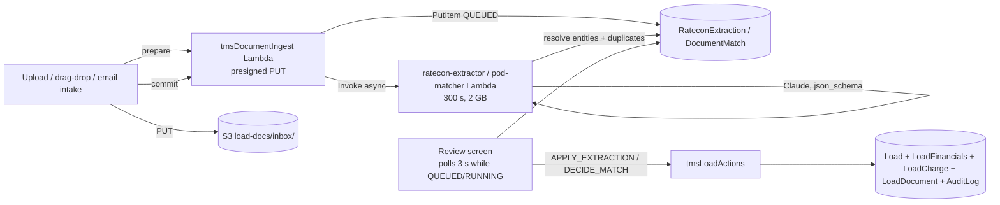

# BCAT Ops → TMS: Design (Phase 0)

> Status: **DRAFT for review — rev 2 (architecture-review corrections, see §12).** Nothing in this document is built except the Phase 1 directory work in progress on `feat/tms-phase-1-directory`. Written on `feat/tms-phase-0-discovery`, revised on `feat/tms-phase-1-directory`.
> Companion brief: `Docs/TMS_BUILD_PROMPT.md`. Every claim about current code cites `file:line` as of commit `6e5a5b5` (application code unchanged since `f93e34f`).
>
> **Legend.** `[VERIFIED]` = read in source at the cited line during this revision · `[PROPOSAL]` = a design choice, open to change · `[UNVERIFIED]` = cannot be established from the repository (console state, production behaviour, vendor terms) · `[DECISION Qn]` = a business/product question in §11 that must be answered before the phase that depends on it. Unlabelled statements in §1–2 are `[VERIFIED]`; §3–10 are `[PROPOSAL]` unless labelled otherwise.

Contents
1. What exists today (audit)
2. Corrections to the brief
3. Design principles
4. Target data model
5. GSIs and DynamoDB limits
6. Server-side actions and access control
7. Async document pipeline (ratecon / POD)
8. Migration plan
9. Aljex cut-over plan
10. Phase plan with schema diffs, risks, test plans
11. Open questions (prioritised decisions)
12. Rev 2 change log

---

## 1. What exists today

### 1.1 Platform
- React 19 SPA, single Zustand store (`src/store/useAppStore.ts`, no slices) plus newer poll-based hooks (`src/hooks/useFactoringItems.ts:84`, `useVendorPayables.ts:122`, `useIntakeItems.ts:42`: `useState` + `setInterval(load, POLL_MS)`). Raw GraphQL strings via untyped `generateClient()` in `src/lib/apiClient.ts:12`; field lists are string constants with self-healing "pre-deploy" flags (`loadsHaveHot`, `loadsHaveStops`, `loadsHaveSortOrder` — `apiClient.ts:35-44, 111-141` retry without a field the backend rejects).
- **AppSync subscriptions are in use** (rev 1 said "none" — that was wrong). `subscribeToLoadChanges` (`apiClient.ts:197-235`: `onCreateLoad` / `onUpdateLoad` / `onDeleteLoad`) is wired in `useAppStore.initializeData` (`useAppStore.ts:538-551`) and **replaces the whole in-store `Load` with the subscription payload**; `subscribeToDriverAvailabilityChanges` (`apiClient.ts:1245`, used by `hooks/useDriverAvailability.ts:24`); `subscribeCashCheckIns` / `subscribeCashSettings` (`lib/cashCheckInClient.ts:217-262`, used by `hooks/useCashCheckIn.ts:143-150`). Other live surfaces poll (Intake, Factoring, Vendor AP, Disputes at 30 s; the calendar does a periodic full refetch as a safety net, `CalendarPage.tsx:107-123`; `AuthContext.tsx:78` refreshes every 60 s). Two consequences shape §6: (a) Lambdas that write DynamoDB with the SDK — every existing action Lambda, e.g. `vendor-ap-actions` — do **not** emit AppSync subscription events, which is why `DisputesPage.tsx:491` polls; (b) Amplify **field-level authorization nulls protected fields in subscription payloads** (Amplify docs, "Customize your auth rules"; field-level rules must also be added to every required field of the model). Because the store overwrites loads wholesale from those payloads, field-level auth on `Load` would blank fields on every other open client. Nothing in this design puts field-level auth on a subscribed model.
- Auth: Cognito groups `ADMIN`, `DISPATCHER` (`amplify/auth/resource.ts:15`) plus dynamic `page-<key>` groups created by `userManagement`. Client guard `hasPageAccess = isOwner || ADMIN || page-<key>` (`src/context/AuthContext.tsx:132-133`), route guard `RequirePage` (`src/components/RequirePage.tsx`). **Server-side** enforcement exists in exactly two places: `userManagement` (owner-only) and `vendor-ap-actions/handler.ts:100-107, 122-142` (`getGroups(identity)` → owner / `ADMIN` / `page-vendorAp`, plus `page-invoices` for `SEND_MAINTENANCE`). Model-level ADMIN gates: `FactoringItem` delete, `VendorPayable` delete, `CashCheckIn` / `CashSettings` full CRUD (`amplify/data/resource.ts:441-444, 470-473, 1283-1308`). Every other model is `allow.authenticated()` — **any user in the pool, whatever their groups, can read and write every `Load`, `Driver` (CDL, medical card, phone), `Customer`, `Location`, `IntakeItem`, … through the API**; page grants are a UI convention. Storage grants are `allow.authenticated` on every prefix (`amplify/storage/resource.ts`), mirrored to `ADMIN` / `DISPATCHER` because Cognito group roles do not inherit authenticated grants (comment at the top of that file). This is the fact behind the driver-identity rule in §6.
- Audit: `AuditLog { entityType, entityId, action, user, changes: json }`, create+read only (`resource.ts:487-499`). Written from the store (`writeAudit`, `useAppStore.ts:431`; 6 call sites: Load/Driver create/update/delete), `complianceClient.ts`, and directly by `compliance-scanner` and `onboarding-portal-api`. No GSI — the audit page lists everything. `src/types/index.ts:315` narrows `EntityType` to `'Driver' | 'Load'`; new entity types widen it.
- Deploy: every push to `main` → `ampx pipeline-deploy --branch $AWS_BRANCH` (`amplify.yml`). Whether a `feat/*` branch environment is currently connected is an Amplify Console setting `[UNVERIFIED]`; `backend.ts:737-745` records that branch deploys once collided on the SES domain identity, so branch backends have existed. Pre-commit: lockfile guard + `tsc --noEmit`.
- 31 Lambdas (`amplify/backend.ts:10-41`): AppSync resolvers, public Function URLs (secret- or token-authenticated bridges: Slack, Gmail, factoring, vendor AP, fuel, dispute, onboarding portal), EventBridge crons, one DynamoDB stream consumer (`broker-load-alert` on the Load table, `backend.ts:905`). `paychex-pay-sync` is defined and granted (`backend.ts:722-734`) but wired to no trigger.
- Docs: `Docs/ARCHITECTURE.md` is stale (lists `/schedule`, `/audit-log`, `@aws-amplify/ui-react`, `fuelDateUtils` — none present). `POST-DEPLOY-RUNBOOK.md:18, 65` references CFN outputs `SesDkimRecord*` that `backend.ts` never emits (the SES identity is managed out of band, `backend.ts:737-745`).

### 1.2 Load (`amplify/data/resource.ts:19-54`, `src/types/index.ts:277-312`)
33 fields. Relevant ones:

| Field | Type | Notes |
|---|---|---|
| `aljexId` | string **required** | "Pro #" in the UI |
| `tmsId` | string **required** | "TMS ID / PO" |
| `pickupNumber` | string **required** | "PU #" |
| `customer` | string | **free-text name**, no `customerId` anywhere (grep confirmed). Batory behaviour keyed on `/batory/i` in 4 files / 5 sites (§1.3) |
| `stops` | json | **canonical** `Stop[]` — see below |
| `pickupAppt`, `deliveryAppt` | string **required** | legacy mirrors, dual-written from stops |
| `pickupApptEnd/Type`, `deliveryApptEnd/Type`, `originName/City`, `destinationName/City`, `pickupDriverId`, `deliveryDriverId` | string | legacy mirrors |
| `rate` | integer | **CENTS** (see §2.1) |
| `miles` | integer | client-side Nominatim + OSRM estimate (`LoadDrawer.tsx:113-131`) |
| `truckId` | string | Equipment.id, not editable in the drawer |
| `readyToInvoice` | boolean **required** | the only "status"; feeds calendar/grid tabs and dashboard `needsInvoice` |
| `rateConfirmKey` | string | S3 `rate-confirms/{loadId}/rate-confirm.{ext}` |
| `hot`, `unscheduled`, `colorKey`, `daySlot`, `sortOrder`, `notes`, `createdBy`, `updatedBy` | | calendar/UI |

**There is no `status`, no customer/carrier/location FK, no charges, no documents table, no check calls, no GSI on Load.** `listLoads` runs **one** `listLoads(limit: 10000)` request with no `nextToken` loop (`apiClient.ts:111-141`), unlike `listFactoringItems` / `listVendorPayables` / `listAmazonDisputes`, which page (`apiClient.ts:618-631, 673-684, 1349-1367`). A DynamoDB scan page is capped at 1 MB, so the grid, calendar and dashboard will **silently lose rows** once the Load table passes roughly 1 MB — nothing may be imported into `Load` until Phase 2 replaces the scan with paged/indexed queries (§5, §9).

`Stop` (`src/types/index.ts:227-266`): `id, type: 'pickup'|'delivery', name?, city?, appt, apptType?: 'exact'|'range'|'fcfs'|'tbd', apptEnd?, driverId, colorKey?, sequence` plus the Batory booking-ladder fields (`apptStatus, apptProofs, apptThreadTs, apptMoveRequested, apptMoveTaskId, apptChangeTo, apptRequestedFor, apptCleared`). One driver per stop subsumes "split loads" (`deriveSplitFromStops`, `LoadDrawer.tsx:74`).

Dual-write layer `src/lib/stops.ts`: `getStops` (reads stops or synthesizes two from legacy), `deriveLegacyFields` / `withDerivedLegacy` (stops → mirrors), `withStopsFromLegacy` (mirrors → stops; added after 26 production loads drifted). Enforced **only** in `store.addLoad/updateLoad` (`useAppStore.ts:636, 669-673`). ~30 files still read legacy fields directly (notably the calendar views, grid tabs, `useDashboardMetrics`, `fleetProfitability.ts`, `appt-report` and `broker-load-alert` Lambdas).

Write paths: `LoadDrawer.tsx` (create/edit, explicit save, zod `loadSchema`), calendar drag/resize (`SchedulerView.tsx:266-274` writes legacy driver/appt fields), grid bulk reassign (`GridPage.tsx`), Appts board stop edits (`updateStop → updateLoad({stops})`). **`readyToInvoice` is toggled from six UI sites**, all through `store.updateLoad`: `LoadDrawer.tsx:1127`, `GridCalendarView.tsx:457`, `PlannerView.tsx:772`, `SchedulerView.tsx:374, 392` (bulk + context menu), `GridPage.tsx:259, 307` (cell + bulk). **`rate` is written from two sites**, both `Math.round(dollars * 100)`: `LoadDrawer.tsx:1128` and the planner's inline cell `PlannerView.tsx:426`.

"Broker Need to Cover" is a placeholder `Driver` with `type === 'broker'` (`broker-load-alert/handler.ts:5-8, 25-26`; `useDashboardMetrics.ts:142`; `fleetProfitability.ts:76-77, 206`): a load "assigned" to that driver is **uncovered**, not dispatched. Any status logic that reads driver assignment must exclude it.

### 1.3 Directory
- `Customer { name!, contactName, contactEmail, contactPhone, notes }` (`resource.ts:375-383`). No dedupe, no GSI. Delete confirm says "Loads keep their typed name".
- `Location { name!, city, customerName, apptContactName, apptContactEmail, apptContactPhone, notes }` (`resource.ts:385-395`). Matched from a stop by **exact lower-cased name** (`LoadDrawer.tsx:498`, `ApptProofPanel.tsx` request modal). No address, no lat/lng, no id on the stop.
- Batory is special-cased by regex in 4 files / 5 sites: `lib/apptQueue.ts:122` (`requiresApptProofs`), `store/useAppStore.ts:627` (ladder + tasks on create), `LoadDrawer.tsx:616` (defaults) and `:1069` (ratecon path), and the `appt-report` Lambda (`amplify/functions/appt-report/handler.ts:69`) — the backfill flag must reach the Lambda too.
- No geocoding helper, no address normalizer, no fuzzy matching anywhere in `src/lib` at `6e5a5b5`. `@vis.gl/react-google-maps` is in `package.json` with **zero imports** in `src/`; `VITE_GOOGLE_MAPS_*` env vars (`.env.example:12-14`) are unused. The dashboard map is SVG d3-geo (`FleetMiniMap.tsx`).

### 1.4 Ratecon / intake
- `parseRateConfirm(fileBase64!, mediaType, todayISO): AWSJSON` → `ratecon-parser` Lambda, synchronous inside the 30 s AppSync cap (`resource.ts:12`; SDK timeout 24 s, `maxRetries: 0`, `handler.ts:48`). Output is only `{ pickup: {date,time,timeEnd}, delivery: {...} }` (`handler.ts:18-40`). Model/SDK facts in §2.7.
- `uploadRateconAndApply` (`src/lib/rateconUpload.ts:15-60`, called from the LoadDrawer view panel `LoadDrawer.tsx:1069-1072` and the Appts board) **already writes the extracted appointment times onto the stops with no review step**, and the Appts board then shows the stops CONFIRMED (`apptStatus.ts:20-22`). This is an existing exception to the brief's "AI never overwrites data silently"; the brief asks to keep it working, so it stays as-is and is named here rather than hidden. The new extractor (§7) does not extend this path.
- `IntakeItem` (Gmail/Slack/manual; `s3KeyPdfAttachments` is **always `[]`** — neither bridge captures attachments). "Build Load" opens a blank drawer and only links `builtLoadId` back (`LoadDrawer.tsx:1142-1152`); **no field is copied**.
- The reusable async ingestion pattern is `vendor-ap-intake`: `prepare` (presigned PUT per attachment, 300 s) → client uploads → `commit` (HEAD-verifies size + content type, conditional `PutItem`). S3 prefix `intake-pdfs/vendor-ap/{sha256(messageId)}/{i}-{name}.{ext}`.
- S3 bucket `bcatRateConfirms` prefixes (`amplify/storage/resource.ts`): `rate-confirms/*`, `driver-photos/*`, `driver-pay-masters/*`, `intake-pdfs/*` (read-only to users), `appt-proofs/*`, `compliance/*`, `dispute-proofs/*` (read-only), `dispute-responses/*`, `dispute-staff-proofs/*`.

### 1.5 Money today (mixed units — the single largest bug source)
| Cents (integer) | Dollars (float) |
|---|---|
| `Load.rate`, `MaintenanceInvoice.amount`, `VendorPayable.amount`, `InsuranceLineItem.annualCents`, `CashFlow*` | `AmazonTrip.freightAmount`, `BoxTruckTrip.grossProfit/customerRate/carrierCost`, `DriverPayPeriod.grossPay`, `DriverPayDeduction.amount`, `DriverPayCredit.amount`, `FuelTransaction.*`, `ExpenseRecord.amount`, `RecurringExpense.monthlyAmount`, `CashCheckIn.*`, `AmazonDispute.*` |

### 1.6 Finance features
- **No customer invoice model, no invoice number, no AR.** `readyToInvoice` is a dead-end boolean.
- Factoring: `FactoringItem { id = proNumber, status NEED_TO_FACTOR|PENDING_WITH_OTR|FACTORED, subject, fromEmail, receivedAt, messageId }` from `ivanfactoring@` emails (`resource.ts:432-445`; the id **is** the PRO so duplicates collide — the repo's own uniqueness-by-primary-key precedent). **No load/invoice link.** "OTR" is hard-coded only as the status label.
- Vendor AP: `VendorPayable` + `manageVendorPayable` Lambda (`SEND_MAINTENANCE | UPDATE_DETAILS | COMPLETE | REOPEN`), optimistic `expectedUpdatedAt` guards, DynamoDB transaction with `MaintenanceInvoice`; model auth `authenticated read` + `ADMIN delete`, writes only via the Lambda's IAM role (`resource.ts:470-473`). **This is the model for every finance write in the TMS**, with one change: posted ledgers get no user delete at all (§6).
- Driver pay: one shared calculator `calcDriverPay(trips, setting, deductions, credits, debits)` (`src/lib/driverPay.ts:278`) on `PayTripInput { freightAmount }` (dollars, `:24-27`). `tripPayAmount(freightAmount, setting)` (`:273-276`) applies `payPercent` **exactly once** per trip (or defers it to the check total when `expensesBeforePercent`); `effectivePayRate(setting, periodStart)` (`:221-230`) resolves pinned `rateHistory` windows so past periods never move; `effectiveFixedExpenses` (`:132`) prorates dated expense revisions. Driven by `DriverPaySetting { payGroup AMAZON|LOCAL|BOX_TRUCK, payPercent (0..1 float), expensesBeforePercent, fixedExpenses(json revisions), rateHistory(json) }` (`resource.ts:268-287`). **Only one pay method exists: % of gross** (before/after expenses). Trip sources: `AmazonTrip` (Sun–Sat weeks), `BoxTruckTrip` (14-day Wed→Tue anchored `2026-06-10`, `biweekly.ts:9`, already carries `loadId/aljexPro/customer/salesRep`), and `DriverPayPeriod` (Paychex lump, 14-day anchored `2026-06-08`, `payPeriods.ts:8`). Three period anchors. `useBoxTruckPay.ts:214` already derives trips from Loads (`grossProfit = rate/100`).
- Profitability: `calcFleetProfitability` attributes `Load.rate/100` to the **delivery date** and to `load.truckId`, falling back to the delivery driver's `assignedTruckId` (`fleetProfitability.ts:209-232`); broker-placeholder deliveries count as broker revenue, not truck revenue; membership from `Equipment.fleetGroup`. Profit centers are hard-coded: `cashCheckIn.ts:11-15` (`bcat` "BCAT Logistics", `ivan` "Ivan Cartage", `amazon` "Amazon DSP"), `fleetGroups.ts:3-9` (LOCAL/AMAZON/BOX_TRUCK), `branding.ts:9` `COMPANY_NAME = 'IVAN CARTAGE'`.
- Pricing margin (`/pricing-margin`) is the Best Care Auto Transport WordPress quote margin, not freight.

### 1.7 Telematics
`TruckLocation` (PK `truckId`, one row per truck, overwritten every 10 min by **two** writers: `motive-location-sync` and `blueink-sync`, `backend.ts:436, 493`) + `TruckLocationHistory` (PK truckId + locatedAt, `resource.ts:674`; **no TTL** — grep `timeToLive` in `amplify/` → none). Written via the DynamoDB SDK, read via AppSync `listTruckLocations`. Unmatched vehicles keyed `motive:<n>` / `blueink:<n>`.

### 1.8 Tests
`vitest run`, `environment: 'node'`, render tests start with `// @vitest-environment jsdom`, co-located `*.test.ts(x)`, mocks via `vi.hoisted` + `vi.mock('@/hooks/...')`. Pure-lib coverage is good (stops, apptStatus, apptQueue, driverPay, fleetProfitability, cashCheckIn, vendor-ap-actions, factoring-intake, vendor-ap-intake). No tests for `ratecon-parser`, `DirectoryPages`, `useDirectory`, `LoadDrawer` beyond one render test.

---

## 2. Corrections to the brief

1. **`Load.rate` is integer cents, not whole dollars — for every row written by this codebase.** `[VERIFIED]` The schema field and its `// total load revenue in cents` comment arrived together in `574c607` (2026-05-18); the first writer — the planner's inline cell (`d78828a`, 2026-05-19, now `PlannerView.tsx:426`) — and the drawer (`167e2f9`, 2026-05-21, now `LoadDrawer.tsx:1128`) have always stored `Math.round(dollars * 100)`; every reader divides by 100 (`fleetProfitability.ts:220`, `revenueAudit.ts:88`, `ExpensesPage.tsx:837`, `useBoxTruckPay.ts:214`, `GridCalendarView.tsx:260`); no script under `scripts/` writes `Load.rate`; the fleet-data import (`e46a647`) touched equipment/maintenance only. `[UNVERIFIED]` A production read on 2026-09-28 (665 loads; min 7 500, p10 35 000, median 60 000, p90 100 000, max 250 000; 286 values not multiples of 100) is *consistent* with cents but **a value distribution cannot prove the unit of any individual row** — a whole-dollar `7500` and a cents `7500` are the same number, and out-of-band writes (console, ad-hoc scripts) cannot be excluded from the repo. Treatment: no boundary conversion for existing data; `backfillLoadFinancials` (§8) writes a review CSV of rows whose `rate` is a multiple of 100 **and** ≥ 100 000 (the band where a whole-dollar entry would be plausible) before it writes anything, and the Aljex import is the only place dollars → cents happens.
2. **No Google Maps is in use.** The brief says geocoding is "already used by the dashboard map"; it isn't. `@vis.gl/react-google-maps` is installed but unused; the map is SVG. We need a Google Maps Platform key (Geocoding + Places Autocomplete; Routes/Distance Matrix and Maps JS only from Phase 8) as a new secret/env — a manual step for the runbook.
3. **The ratecon parser is synchronous and two-appointment only**; nothing about it is reusable for a full extractor except the SDK conventions. It must keep working for the Appts board (kept as-is; the new extractor is a separate Lambda).
4. **`readyToInvoice` must be kept** as a dual-written mirror of the new status (six writers, many readers, §1.2), exactly like the stops mirrors — with the non-regression rules in §4.5.
5. **Subscriptions exist** (§1.1; rev 1 said they didn't). Rule: user edits keep flowing through `store.updateLoad` so subscriptions fire and other clients converge; Lambda-written records (`LoadFinancials`, ledgers, extractions, matches) emit no events, so their screens poll (repo convention: `DisputesPage.tsx:491`, `useVendorPayables.ts:122`) and the acting client applies the Lambda's returned record to local state. No new subscription is added, and no field-level auth is put on a subscribed model.
6. **Name collisions.** `src/features/invoices/` + `/invoices` (**maintenance** invoices, `MaintenanceInvoice`) are unrelated to the TMS customer AR. New names avoid them: the TMS carrier directory lives in `src/features/carrier-directory/` at `/carrier-directory` (page key `carrierDirectory`), model `Carrier`; AR lives in `src/features/ar/` at `/invoicing` (page key `invoicing`), model `Invoice`, component `ArInvoicesPage` — never `/invoices`/`InvoicesPage`.
7. **Model id and SDK.** `[VERIFIED]` Both parsers call `client.messages.stream({ model: 'claude-sonnet-5', max_tokens, output_config: { effort: 'low', format: { type: 'json_schema', schema } } })` (`ratecon-parser/handler.ts:57-60`, `trip-screenshot-parser/handler.ts:83-89`) on `@anthropic-ai/sdk` `^0.116.0` (`package.json`; 0.116.0 installed in `node_modules`), with the key from the `ANTHROPIC_API_KEY` Amplify secret. `[UNVERIFIED]` Whether that call currently succeeds in production — the repo holds no test, fixture, or log for either parser, and the secret's presence in the Amplify Console is not visible from the repo. No `claude-api` skill exists in this environment to check the model id against. Treatment: the extractor reads `ANTHROPIC_MODEL` from env with the source value as its default, and Phase 3 begins with one sandbox call against the installed SDK before any prompt work.

---

## 3. Design principles

- **Extend, mirror, backfill.** No existing field is renamed or removed. New fields on existing models are optional. Where a new canonical record supersedes an old field (`status` ⇢ `readyToInvoice`, `customerId` ⇢ `customer`, `LoadFinancials` ⇢ `rate`), the old one is dual-written from the new one in **one** place (store write path or the owning Lambda), same as `withDerivedLegacy`, and the stream projector re-derives it when they disagree. Backfills are `scripts/*.mjs`, dry-run by default, `--apply` to write, following `scripts/setChadPayRates.mjs` auth.
- **Money = integer cents**, field suffix `Cents`, in every new model and every new field; percentages are basis points (`Bps`, integer). Pure math in `src/lib/money.ts` (`addCents`, `pctOfCents(cents, bps)` rounding half-up once, `allocateCents` largest-remainder split, `centsToDollars` only at a display or legacy-engine boundary). The existing dollar-float pay engine is **extended**, not wrapped or duplicated (§4.14).
- **Money is committed only by ledgers.** A load carries operational data and a *proposed* price. What is actually billed, paid, advanced, settled or commissioned exists only as a ledger row (`Invoice`/`InvoiceLine`, `Payment`, `FactoringEvent`, `CarrierBill`, `Advance`, `SettlementLine`, `CommissionEntry`) written by `tmsFinanceActions` under a DynamoDB transaction. Users cannot write ledgers through AppSync at all.
- **Posted is immutable; corrections are reversals.** An issued invoice, a recorded payment, a posted settlement line, a submitted factoring batch or a posted commission entry is never edited or deleted. A mistake is corrected by a reversing record (`VOID` → reversal lines, `CREDIT_MEMO`, `CHARGEBACK`, negative `SettlementLine{reversesLineId}`) that points at what it reverses. Drafts may be edited/deleted, through the Lambda.
- **Status is evidence, never inference.** `Load.status` changes only when a person or an integration reports an event (status button, check call, POD decision, invoice issue, payment). No backfill and no projector derives DELIVERED, DISPATCHED or POD_RECEIVED from appointment dates, driver assignment or the RTI flag (§8). Legacy loads keep whatever evidence they have (RTI, appointments, drivers) and show as "Legacy" until someone sets a status.
- **Every finance write goes through a Lambda** (`tmsFinanceActions`, pattern = `vendor-ap-actions`): `action + input`, `expectedUpdatedAt` guards, `TransactWriteItems`, ADMIN/page-group checks server-side with the `getGroups` helper.
- **AI proposes, people commit.** `RateconExtraction` / `DocumentMatch` records hold the proposal with per-field `{ value, confidence, sourceText }`. A Load is created only by a human click. Whether a POD may be *attached* automatically is an unresolved contradiction in the brief and is a recorded gate (`[DECISION Q13]`, §7), not a default this document picks. Every AI decision writes an `AuditLog` row.
- **Snapshots on the load.** Stops store `locationId` **and** the address/name as booked; the load stores customer/carrier names as booked; invoice lines snapshot charge amounts. Directory or rate edits never rewrite history.
- **Keep the in-memory model bounded.** Historical Aljex loads go to `LoadArchive` (§4.17, §9), never to `Load`. Load lists move to paged GSI queries in Phase 2 so the unpaged scan (§1.2) stops being a time bomb.
- **Driver identities are not staff identities.** Nothing a driver logs in with can call the staff AppSync API or assume the authenticated storage role (§6).

---

## 4. Target data model

Notation: `field: type` · `!` required · `[]` list · `json` = AWSJSON (typed in `src/types/tms.ts`) · `→Model` = string id reference (repo has no relationships; keep that) · all money `Cents: integer`, all percentages `Bps: integer`. Authorization per model is in §6; "Lambda-only" below means users have read access and no write access through AppSync.

### 4.1 `Division` (new)
Revenue divisions replace the hard-coded profit centers.
```
key!: string            // 'BCAT_LOGISTICS' | 'IVAN_CARTAGE' | 'AMAZON_DSP' — seed; more via Settings
name!: string
legalName, mcNumber, dotNumber, scac, remitToName, remitToAddress: json, remitToEmail
invoicePrefix: string   // e.g. 'BL'
fleetGroup: enum LOCAL|AMAZON|BOX_TRUCK   // links to Equipment/Driver.fleetGroup for profitability
active!: boolean
```
Singleton config also lives here: `TmsSettings { id='default', marginFloorBps, defaultPaymentTermsDays, accessorialCodes: json[], loadStatusRules: json, invoiceNumberFormat }`.

### 4.2 `Customer` (extend)
```
+ mcNumber, dotNumber, billingEmail, billingContactName, billingPhone
+ billingAddress: json {street, city, state, zip, country}
+ paymentTermsDays: integer, creditLimitCents, creditHoldFlag: boolean
+ requiredDocsForInvoice: string[]   // ['POD','BOL','LUMPER_RECEIPT'] — LoadDocument.type keys
+ defaultDivisionKey: string, defaultSalesRepId: string
+ aliases: string[]                  // names seen on ratecons that resolve here
+ normalizedName: string             // GSI key for dedupe (lower, strip punctuation/legal suffixes)
+ active: boolean, apptWorkflow: enum NONE|BATORY   // replaces the /batory/i regex
```

### 4.3 `Location` (extend)
```
+ street, state, zip, country
+ lat: float, lng: float, timezone, geohash6: string   // 150 m dedupe uses geohash prefix + haversine
+ facilityType: enum SHIPPER|RECEIVER|BOTH|YARD|TRUCK_STOP|OTHER
+ hours, apptRule: enum FCFS|APPT|EITHER, apptLeadTimeHours, dockNotes, lumperNotes, detentionNotes
+ contacts: json[] {name, role, email, phone}
+ customerIds: string[]               // many-to-many (customerName stays as a legacy mirror = first customer's name)
+ aliases: string[], normalizedName, normalizedAddress: string
+ mergedIntoId: string                // set by the merge tool; reads follow the pointer
+ active: boolean
```

### 4.4 `Carrier` (new — outside carriers; own fleet stays Driver/Equipment)
```
name!, normalizedName, mcNumber, dotNumber, scac
dispatcherName, dispatcherPhone, dispatcherEmail, phone, email
cargoInsuranceExp, liabilityInsuranceExp, generalLiabilityExp: date
safetyRating: enum SATISFACTORY|CONDITIONAL|UNSATISFACTORY|NONE|UNKNOWN
paymentTermsDays, quickPayFeeBps, remitToName, remitToAddress: json
factoringCompanyName, factoringRemitTo: json
doNotUse: boolean, doNotUseReason
w9DocumentId, coiDocumentId: →LoadDocument (entity docs reuse LoadDocument with entityType='Carrier')
notes, active!
```
Dispatch to a carrier with any insurance date < load pickup date is refused server-side (`tmsLoadActions.ASSIGN_CARRIER`).

### 4.5 `Load` (extend — all additive; operational data only, no money totals)
```
+ status: enum QUOTE|TENDERED|BOOKED|DISPATCHED|AT_PICKUP|LOADED|IN_TRANSIT|AT_DELIVERY|DELIVERED|POD_RECEIVED|INVOICED|PAID|CANCELLED|TONU
                                  // OPTIONAL. Absent on every existing load ("Legacy") until a person sets it (§8).
+ statusChangedAt, statusChangedBy, statusSource: enum USER|DRIVER_APP|CHECK_CALL|POD|FINANCE|IMPORT
                                  // the history is AuditLog rows (auditByEntity), not an array on the item (§5 limits)
+ customerId: →Customer  (customer string kept as name snapshot)
+ customerRef, bolNumber, refs: json[] {type, value}            // PO, BOL, PU#, DEL#, SO, CUST_LOAD#, PRO...
+ mode: enum FTL|LTL|PARTIAL|POWER_ONLY|BOX_TRUCK|AMAZON
+ equipmentType, weightLbs: integer, pieces: integer, commodity, tempF: float, hazmat: boolean
+ items: json[] {description, qty, weightLbs, class, dims}
+ divisionKey: string, salesRepId, serviceRepId, dispatcherAssignedId, dispatcherActualId  (→ Cognito username)
+ tariff, quoteNumber, tags: string[]
+ specialInstructions (≤420), bolNotes (≤260)                     // limits enforced in zod + Lambda
// assignment
+ assignmentType: enum OWN_ASSET|CARRIER|BROKER_NEED_TO_COVER
+ carrierId: →Carrier, carrierName (snapshot), carrierDispatcher, carrierDriver1Name/Cell/Email, carrierDriver2Name/Cell/Email
+ carrierTruckNumber, carrierTrailerNumber, sealNumber, carrierRef, emptyFromCity, emptyFromState, emptyMiles: integer
+ puEta, confirmSentAt, confirmReceivedAt, dispatchedAt: datetime
+ driver2Id: →Driver, trailerId: →Equipment                        // own asset; driver1 = stops[].driverId, truckId exists
// tracking
+ trackingProvider: enum NONE|MANUAL|LINK|DRIVER_APP|MOTIVE, trackingStatus, trackingStartAt, trackingDurationHours, trackingIntervalMin, trackingLastUpdateAt, trackingExternalId
+ nextCheckCallAt, nextCheckCallNote, checkCallOpen: string        // 'OPEN' while nextCheckCallAt is set — sparse GSI pk (§5)
// invoicing links (written by tmsFinanceActions only; display mirrors of the ledgers)
+ invoiceId: →Invoice, invoicedAt, paidAt
+ laneKey: string, laneKey3: string  // 'CITY|ST>CITY|ST' from first pickup/last delivery snapshot; zip3 fallback
+ pickupMonth: string                // 'YYYY-MM' of pickupAppt — date-window GSI pk (§5), written with the other mirrors
+ source: enum MANUAL|RATECON|INTAKE|IMPORT, rateconExtractionId
```
**Money is not on `Load`.** Rate types, linehaul/FSC inputs, cached totals and margin live in `LoadFinancials` (§4.6), a separate Lambda-only model keyed by the load id. Reasons: `Load` is `allow.authenticated()` and subscribed, so any field on it is user-writable through AppSync, and field-level auth is unusable on it (§1.1). The legacy `rate` stays on `Load` as a **display mirror** of `LoadFinancials.customerTotalCents`, written by `RECALC_CHARGES` in the same transaction; the two existing `rate` writers (`LoadDrawer.tsx:1128`, `PlannerView.tsx:426`) are migrated to call `RECALC_CHARGES` in Phase 2. A raw `rate` write can still happen through AppSync; it cannot commit money (invoices bill from `LoadCharge`/`InvoiceLine`), and `load-stream-projector` re-derives `rate` from `LoadFinancials` when a financials row exists and logs `AuditLog{action:'rate_mirror_drift'}`. Loads without a financials row keep `rate` as the legacy value.

**Mirrors and non-regression rules** (`src/lib/loadMirrors.ts`, next to `stops.ts`, applied in `store.addLoad/updateLoad` and in `tmsLoadActions`/`tmsFinanceActions`):
- `readyToInvoice` ← `status ∈ {POD_RECEIVED, INVOICED, PAID}` **when `status` is set**. When `status` is absent (legacy), `readyToInvoice` is authoritative and untouched.
- Toggling RTI **on** from any of the six UI sites (§1.2) on a load with `status` set and below `POD_RECEIVED` sets `status = POD_RECEIVED, statusSource = USER` (a human said "ready" — that is evidence, not inference). On a legacy load it flips the flag only, as today.
- Toggling RTI **off** is allowed only when `status ∈ {POD_RECEIVED}` or absent; when `status ∈ {INVOICED, PAID}` the store refuses (toast "Invoiced — void the invoice first") and the projector re-derives `readyToInvoice = true` if a raw write got through. **Paid or invoiced state never regresses through the RTI toggle.**
- `INVOICED` / `PAID` / back to `POD_RECEIVED` on void are set only by `tmsFinanceActions`; `SET_STATUS` refuses those values.
- `rate` ← `LoadFinancials.customerTotalCents` (above); `customer` ← `Customer.name` when `customerId` is set.

**Stop (json, extended — no schema change):**
```
+ locationId: →Location
+ address: {street, city, state, zip, country, lat, lng, timezone}   // snapshot at booking
+ refs: json[] {type, value}, contact: {name, phone, email}
+ arrivedAt, departedAt: datetime, pieces, weightLbs, instructions
```
`name`/`city` stay as the display snapshot, so every existing reader keeps working. `arrivedAt`/`departedAt` are written from check calls / driver app events, never inferred.

### 4.6 `LoadFinancials` (new — Lambda-only; id = loadId) and `LoadCharge` (new — Lambda-only)
```
LoadFinancials: id! (= Load.id), loadId!
  customerRateType: enum FLAT|PER_MILE|HOURLY|PER_CWT, customerHours: float, customerLhRateCents, customerFscBps, customerFscPerMileCents, smrCents
  carrierRateType, carrierHours, carrierLhRateCents, carrierPayBps, carrierMaxRateCents
  customerTotalCents!, carrierTotalCents!, netCents!, marginBps!     // cached from LoadCharge rows
  frozenAt, frozenBy                                                  // set at CREATE_INVOICE; RECALC refuses afterwards
  updatedBy!, version: integer                                        // optimistic guard
LoadCharge: loadId!, side!: enum CUSTOMER|CARRIER, code!: string   // LINEHAUL|FSC|DETENTION|LAYOVER|LUMPER|TONU|STOP_OFF|DRIVER_ASSIST|... from TmsSettings.accessorialCodes
  description, qty: float, rateCents, amountCents!: integer, release: boolean, sortOrder: integer, createdBy
```
Dispatch edits rates in the load page; the page calls `tmsLoadActions.RECALC_CHARGES` with the full proposed charge list; the Lambda validates, recomputes totals in `src/lib/loadCharges.ts` (pure, shared with the client preview), and writes `LoadFinancials` + all `LoadCharge` rows + `Load.rate` mirror in one transaction. After `frozenAt` (invoice issued) the action is refused; a price correction is a credit memo or a void + re-invoice, never a silent edit of an invoiced load. One `LoadCharge` row per Aljex accessorial line; LINEHAUL rows are written from the rate-type fields.

### 4.7 `CheckCall` (new)
```
loadId!, at!: datetime, city, state, lat, lng, tempF, note, message: enum ON_TIME|LATE|ARRIVED|LOADED|DEPARTED|DELIVERED|BREAKDOWN|OTHER
ediReason: string ('NS' default), source: enum MANUAL|MOTIVE|DRIVER_APP|LINK, enteredBy, stopId, nextAt, nextNote
```
Driver-app status buttons, tracking-link updates and Motive pings write CheckCalls; `Load.nextCheckCallAt` + `checkCallOpen` are the worklist keys. A check call with `message ∈ {ARRIVED, LOADED, DEPARTED, DELIVERED}` and a `stopId` stamps the stop's `arrivedAt`/`departedAt` and moves `Load.status` (`statusSource: CHECK_CALL`) — that is an event, not an inference.

### 4.7b `LoadBid` and `LoadStopIndex` (new)
```
LoadBid: loadId!, carrierId, carrierName!, amountCents!, at!, by!, notes, accepted: boolean, source: enum MANUAL|EMAIL   // Aljex "Enter Bids"; accepting one runs ASSIGN_CARRIER
LoadStopIndex: id! = '<loadId>:<stopId>', loadId!, stopId!, locationId!, stopType!, appt!, arrivedAt, departedAt, archiveId   // projector-maintained; stops are JSON so this is the only way to query "loads in/out of a location"
```
`LoadStopIndex` rows are written by `load-stream-projector` from `stops[]` (and by the Aljex importer for archive rows whose facility resolved to a `Location`). The Location page's "all loads in/out", average dwell (from `arrivedAt`/`departedAt`, which exist only once check calls or the driver app report them) and detention history read this index; nothing is inferred for stops without reported times.

### 4.8 `LoadDocument` (new — one document store for loads, carriers, invoices)
```
entityType!: enum LOAD|CARRIER|INVOICE|CARRIER_BILL, entityId!, loadId (denormalized for LOAD/INVOICE)
type!: enum CUSTOMER_RATECON|CARRIER_RATECON|BOL|POD|LUMPER_RECEIPT|SCALE_TICKET|INVOICE|CARRIER_INVOICE|W9|COI|OTHER
visibility!: enum PUBLIC|PRIVATE, s3Key!, name!, contentType!, sizeBytes!, pages
uploadedBy!, source!: enum UPLOAD|EMAIL|RATECON|POD_MATCH|DRIVER_APP|GENERATED, extractionId, sha256
```
S3 layout enforces visibility, not the flag alone: `load-docs/{loadId}/public/{documentId}-{name}` and `load-docs/{loadId}/private/{documentId}-{name}`. Storage rules: `load-docs/*/public/*` and `load-docs/*/private/*` → authenticated (staff) read + write, **no delete** (delete via `tmsLoadActions.DELETE_DOCUMENT`, ADMIN or uploader, which also removes the row). Non-staff readers (`driver-app-api`, `tracking-link-api`, `invoice-emailer` packets) get IAM `grantRead` on `load-docs/*/public/*` only, so a private document is unreachable from those paths by policy, not by code. Changing visibility moves the object (Lambda `SET_DOCUMENT_VISIBILITY`). `Load.rateConfirmKey` is mirrored to the current `CUSTOMER_RATECON` key. `ComplianceDocument` (driver/truck files) stays separate.

### 4.9 `RateconExtraction` (new — Lambda-only)
```
status!: enum QUEUED|RUNNING|REVIEW|APPLIED|DISCARDED|FAILED
s3Key!, contentType!, sizeBytes, pages, uploadedBy!, source: enum UPLOAD|EMAIL|INTAKE, intakeItemId
model, promptVersion!, startedAt, finishedAt, error, tokensIn, tokensOut
extracted: json          // ExtractedRatecon (schema in §7) — every field {value, confidence 0-1, sourceText, page}
resolved: json           // {customerId, customerMatch: {score, candidates[]}, stops[]: {locationId, match: {...}}, duplicateLoadIds[]}
brokerKey: string        // normalized broker/customer name for accuracy stats
loadId: →Load, appliedBy, appliedAt, corrections: json   // {field: {extracted, final}} written on apply
```

### 4.10 `DocumentMatch` (new — Lambda-only; POD and other paperwork)
```
status!: enum QUEUED|RUNNING|REVIEW|ATTACHED|AUTO_ATTACHED|REJECTED|FAILED   // AUTO_ATTACHED exists only if Q13 allows auto-attach
s3Key!, contentType!, uploadedBy, source: enum UPLOAD|EMAIL|DRIVER_APP, driverId, truckId
docType: enum POD|BOL|LUMPER_RECEIPT|SCALE_TICKET|OTHER (extracted)
extracted: json          // {refs[], shipperName, consigneeName, consigneeAddress, deliveryDate, signaturePresent, receiverName, exceptions[], sealNumbers[]}
candidates: json[]       // [{loadId, score, reasons[]}] top 3
loadId, documentId: →LoadDocument, decidedBy, decidedAt, flags: string[]   // OSD, MISSING_SIGNATURE
```

### 4.11 AR: `Invoice`, `InvoiceLine`, `Payment`, `FinanceNote` (all Lambda-only)
```
Invoice: id! = number (e.g. 'BL-2026-00042'; PutItem with attribute_not_exists(id) — uniqueness by primary key, the FactoringItem precedent)
  customerId!, customerName, divisionKey!, status!: enum DRAFT|ISSUED|PARTIAL|PAID|VOID|WRITTEN_OFF
  issuedAt, dueAt, termsDays, subtotalCents!, taxCents, totalCents!, paidCents!, balanceCents!, writtenOffCents
  remitTo: json (ours or the factor's), factoringBatchId, factored: boolean, pdfDocumentId, sentAt, sentTo
  loadIds: string[] (≤ 40, §5 limits), createdBy, issuedBy, voidedBy, voidReason, voidedAt, reversesInvoiceId
InvoiceLine: invoiceId!, loadId!, chargeId: →LoadCharge, code!, description, amountCents!, sortOrder   // snapshot; never re-read from LoadCharge
Payment: customerId!, receivedAt!, method!: enum CHECK|ACH|WIRE|CARD|OTHER, reference, amountCents!
  kind!: enum PAYMENT|CREDIT_MEMO|SHORT_PAY|WRITE_OFF|REVERSAL, reversesPaymentId
  applications!: json[] {invoiceId, amountCents}, unappliedCents, createdBy, notes
FinanceNote: entityType!: enum INVOICE|CARRIER_BILL|LOAD_AP|LOAD_AR, entityId!, at!, by!, text!   // "Add Invoice Note" / "Add AP Note"
Sequence: id ('invoice:BL'), next: integer      // Lambda-only conditional increment (UpdateItem ADD, ReturnValues)
```
Rules: `paidCents`/`balanceCents` are updated only inside the `RECORD_PAYMENT` transaction that writes the `Payment`; a payment is never edited — `REVERSAL` adds a negative counterpart. `VOID` marks the invoice VOID, restores its loads to `POD_RECEIVED`, un-freezes their financials, and re-parks any applied payments as `unappliedCents` (the payments stay). A customer paying the **factor** is not a `Payment` here (§4.12). Aging = pure function over `Invoice{status, issuedAt, dueAt, balanceCents}` (`src/lib/arAging.ts`), buckets CURRENT|D1_30|D31_60|D61_90|D90_PLUS, DSO.

### 4.12 Factoring: `FactoringCompany`, `FactoringBatch`, `FactoringEvent` (Lambda-only)
```
FactoringCompany: name!, advanceBps!, feeSchedule: json[] {uptoDays, feeBps}, feeTiming!: enum FROM_ADVANCE|FROM_RESERVE, reserveBps, recourseDays, remitTo: json,
  submissionMethod: enum EMAIL|PORTAL|CSV, submissionEmail, divisionKeys: string[], active!
FactoringBatch: factoringCompanyId!, number!, status!: enum DRAFT|SUBMITTED|ADVANCED|SETTLED|CLOSED, invoiceIds: string[], submittedAt, submittedBy
  faceCents!, expectedAdvanceCents!, expectedFeeCents!, expectedReserveCents!    // computed at SUBMIT from the company terms in force, then frozen
  advanceReceivedCents, feesChargedCents, reserveReleasedCents, chargebackCents  // running sums of FactoringEvent rows, maintained in the same transaction
  scheduleDocumentId
FactoringEvent: batchId!, at!, kind!: enum ADVANCE_RECEIVED|FEE_CHARGED|RESERVE_RELEASED|CHARGEBACK|CUSTOMER_PAID_FACTOR|ADJUSTMENT|REVERSAL,
  amountCents!, invoiceId (for CHARGEBACK / CUSTOMER_PAID_FACTOR), reference, enteredBy!, notes, reversesEventId
FactoringItem (existing): + invoiceId, + loadId   // linked by PRO ⇢ Load.aljexId at intake and at invoice issue
```
**Terms are unknown (`[DECISION Q2]`); the formulas are parameters, not assumptions.** `src/lib/factoring.ts` implements both common shapes and the company row picks one:
- `advance = pctOfCents(face, advanceBps)`; `reserve = face − advance` (held by the factor).
- `fee = pctOfCents(face, feeBpsForDays(daysOutstanding))` from the schedule.
- `feeTiming = FROM_RESERVE` (typical): `reserveRelease = reserve − fee − chargebacks`, cash in = advance now, release later.
- `feeTiming = FROM_ADVANCE`: `advancePaid = advance − fee` up front, `reserveRelease = reserve − chargebacks`.
Reconciliation = expected (frozen at submit) vs. the sum of events per batch. Advances, fee charges, reserve releases and chargebacks are **repeated events**, never fields overwritten in place; a mistaken event is reversed by a `REVERSAL` event. The customer's payment to the factor (`CUSTOMER_PAID_FACTOR`) is what closes the customer's obligation on a factored invoice; the factor's advance to us is financing and never marks an invoice paid. How a factored invoice should read in AR (paid at advance, paid at customer-paid-factor, or both shown) is `[DECISION Q14]`. The Cash Check-in factoring scenario reads real batch numbers when present.

### 4.13 AP: `CarrierBill`, `Advance` (Lambda-only)
```
CarrierBill: loadId!, carrierId!, carrierName, status!: enum PENDING_DOCS|APPROVED|SCHEDULED|PAID|DISPUTED|VOID
  grossCents! (= LoadFinancials.carrierTotalCents at approval, snapshot), advancesCents!, quickPay: boolean, quickPayFeeCents, netCents!, dueAt, termsDays
  requiredDocs: string[], missingDocs: string[], carrierInvoiceDocumentId, remitTo: json (carrier or its factor), vendorPayableId: →VendorPayable, approvedBy, approvedAt, paidAt, paymentMethod, paymentReference, voidReason
Advance: loadId!, carrierId, driverId, kind!: enum FUEL|COMCHECK|CASH|OTHER, amountCents!, feeCents, issuedAt!, issuedBy!, reference, deductedInBillId, deductedInSettlementLineId, notes, reversesAdvanceId
```
When a bill is APPROVED it is pushed into the existing Vendor AP queue via `manageVendorPayable` (new action `SEND_CARRIER_BILL`, id `carrier-bill:<billId>`); paying it there closes the bill in the same transaction. One payment queue, as the brief prefers. Notes are `FinanceNote{CARRIER_BILL}` rows.

### 4.14 Settlements & commissions — one pay engine, percent applied once
`calcDriverPay` stays the only pay engine and is **extended**, not wrapped: `PayTripInput` gains `miles?`, `hours?`, `stops?`, `payMethod?` and `rateCents?`; `tripPayAmount` gains a method branch (`PERCENT` = today's behaviour; `PER_MILE|HOURLY|PER_STOP` = `qty × rateCents/100`; `FLAT_PER_LOAD` = `rateCents/100`), and `payPercent` is applied **only** inside that function, exactly as today (`driverPay.ts:273-276`). Rev 1 proposed feeding `SettlementLine.payCents` back in as `freightAmount` — that would apply `payPercent` a second time (or, for `expensesBeforePercent` drivers, apply it to already-computed pay at the check total). Removed.

- `DriverPaySetting` **+** `payMethod: enum PERCENT|PER_MILE|FLAT_PER_LOAD|HOURLY|PER_STOP` (null ⇒ PERCENT), `+ rateCents: integer`, `+ teamSplitBps`. `rateHistory` windows gain `payMethod` + `rateCents` alongside `payPercent`, resolved by the existing `effectivePayRate(setting, periodStart)`; `fixedExpenses` proration is unchanged.
- **`SettlementLine` (new — Lambda-only)**: `driverId!, payGroup!, periodStart!, loadId!, stopIds: string[], role: enum DRIVER1|DRIVER2, basisCents! (gross freight share after team split), method!, rateCents, miles, hours, stops, payCents! (engine output, snapshot), status!: enum DRAFT|POSTED|PAID, postedAt, postedBy, statementPeriodId, source: enum LOAD|MANUAL, reversesLineId`. The engine input for a line is `basisCents/100` (PERCENT) or its `{qty, rateCents}` (unit methods); `payCents` is written from the engine's per-trip amount when the line is **posted** and is never an input. Team split: `allocateCents(customerShareCents, [teamSplitBps, 10000 − teamSplitBps])` in cents (largest remainder) before the engine boundary, so the two lines sum exactly. A POSTED line is immutable; a correction is a negative line with `reversesLineId` plus a new line.
- The LOCAL/brokered-own-driver fleets feed statements from `SettlementLine`; Amazon (`AmazonTrip`) and Box Truck (`BoxTruckTrip`) keep their CSV/screenshot sources, with `BoxTruckTrip` rows generated from Loads where `loadId` is set (it already has the column). `src/lib/settlementAdapter.ts` maps `SettlementLine → PayTripInput` (basis, not pay) so the calculator, credits, debits, fixed expenses and PDFs stay shared and `driverPay.test.ts` keeps covering the money.
- `CommissionRule: repId!, basis!: enum GROSS_MARGIN|REVENUE, rateBps!, paidOn!: enum INVOICED|PAID, customerId (override), divisionKey, effectiveFrom!, effectiveUntil`. `CommissionEntry (Lambda-only): repId!, invoiceId!, loadId!, ruleId!, basisCents!, rateBps!, amountCents!, period (YYYY-MM), status: enum ACCRUED|PAYABLE|PAID, reversesEntryId`. Written by the finance Lambda on invoice issue / payment; a void writes reversing entries.

### 4.15 Rate history: `LaneRateSample` (new)
```
laneKey! ('CHICAGO|IL>DANVILLE|IL'), laneKey3 ('606>618'), date!, customerRateCents, carrierRateCents, miles, customerId, customerName, carrierId, carrierName, divisionKey, equipmentType, loadId, archiveId, source!: enum LOAD|ALJEX_IMPORT
```
Fed by `load-stream-projector` when a load reaches DELIVERED+ **with a financials row**, and by the Aljex import (one sample per `LoadArchive` row). The Historical Rates panel is `src/lib/laneStats.ts` (avg/low/median/high/volume/miles per window) over one GSI query; each row links to the live load or the archive record.

### 4.16 Tracking / driver app
`Load.tracking*` fields (above); provider pings become `CheckCall{source: LINK|DRIVER_APP|MOTIVE}` — no separate `TrackingEvent` model. `TrackingProvider` interface (`start/stop/update/status`) with **real** `MANUAL` (dispatcher enters check calls; the panel shows next-due/last-update), `LINK` (tokenised SMS/email page → `tracking-link-api` → CheckCall) and `DRIVER_APP` implementations in Phase 8, and `MOTIVE` for own trucks. MacroPoint / Trucker Tools are **not** shipped as stub providers: the enum does not contain them until an integration exists; selecting an unintegrated provider is impossible rather than silently a no-op (`[DECISION Q6]`).

Driver identities: drivers do **not** get accounts in the staff user pool (§1.1 shows what that would grant). `[PROPOSAL]` a second Cognito user pool `bcat-drivers` created with CDK in `backend.ts`, `Driver.driverAuthSub` linking the pool user to the Driver row, and `driver-app-api` as a Function URL that verifies that pool's JWT (`aws-jwt-verify`) and reads/writes DynamoDB by IAM with **projections** (assigned loads = `loads where stops[].driverId = me`, stop details, public documents only, own statements). Same shape as `onboarding-portal-api` (public, token-validated Function URL, `backend.ts:563-604`). Alternative, if a second pool is unwanted: the onboarding portal's invite-token pattern. Either way, no `DRIVER` group in the staff pool and no `page-driverApp` grant.

### 4.17 `LoadArchive` (new — the searchable Aljex history)
```
id! = 'aljex:<aljexLoadNumber>', aljexId!, customerName, customerId, carrierName, carrierId, divisionKey, salesRep, mode, equipmentType
stops: json[] (type, name, address snapshot, appt, arrived/departed if exported), refs: json[], commodity, weightLbs, miles
customerTotalCents, carrierTotalCents, charges: json[] {side, code, amountCents}
pickupAt, deliveredAt, invoicedAt, paidAt, invoiceNumber, status (as exported), laneKey, laneKey3, deliveryMonth ('YYYY-MM'), importedAt, importBatch
```
A read-only model with its own GSIs (§5) so customer pages, location pages, Smart Search and the rates panel can search **all** Aljex history, without a single archive row ever entering `Load` (which would break the unpaged scan, §1.2). The row count is whatever the export contains (`[DECISION Q3]`); nothing here assumes a size.

---

## 5. GSIs and DynamoDB limits

DynamoDB allows 20 GSIs per table; Load gets 7. All are Amplify `secondaryIndexes` with explicit `queryField` names (the repo currently uses defaults; naming them keeps `apiClient` strings readable). Rules that rev 1 got wrong and this table follows: a **timestamp is never a partition key** (you cannot range-query a pk); the worklist and date-window indexes use a bounded bucket or a sparse constant as pk and the timestamp as sk; **uniqueness is never checked through a GSI** (eventually consistent) — it is a conditional write on the primary key.

| Model | pk | sk | queryField | Serves |
|---|---|---|---|---|
| Load | `status` | `pickupAppt` | `loadsByStatus` | grid tabs, dispatch worklists (legacy rows have no `status` and are not in this index) |
| Load | `pickupMonth` | `pickupAppt` | `loadsByPickupMonth` | calendar / grid date windows (one query per visible month), replaces the full scan |
| Load | `customerId` | `pickupAppt` | `loadsByCustomer` | customer page, duplicate check (customerId + customerRef filter) |
| Load | `carrierId` | `pickupAppt` | `loadsByCarrier` | carrier page, Smart Search |
| Load | `divisionKey` | `deliveryAppt` | `loadsByDivision` | reporting |
| Load | `salesRepId` | `deliveryAppt` | `loadsBySalesRep` | commissions, reporting |
| Load | `checkCallOpen` (sparse constant `'OPEN'`) | `nextCheckCallAt` | `loadsByNextCheckCall` | overdue worklist: one query `sk ≤ now`; the partition is bounded by active loads with a pending call |
| LoadFinancials | `frozenAt` absent → none needed | | | read by id = loadId |
| LoadCharge | `loadId` | `sortOrder` | `chargesByLoad` | |
| CheckCall | `loadId` | `at` | `checkCallsByLoad` | |
| LoadBid | `loadId` | `at` | `bidsByLoad` | Enter Bids |
| LoadStopIndex | `locationId` | `appt` | `stopsByLocation` | Location page loads in/out, dwell, detention (live + archive) |
| LoadDocument | `entityId` | `createdAt` (declared explicitly) | `documentsByEntity` | + `loadId` GSI for invoice packet |
| LoadDocument | `sha256` | — | `documentsByHash` | duplicate-upload *warning* (advisory, not uniqueness) |
| RateconExtraction | `status` | `createdAt` | `extractionsByStatus` | review queue |
| DocumentMatch | `status` | `createdAt` | `matchesByStatus` | matching queue |
| Invoice | `customerId` | `issuedAt` | `invoicesByCustomer` | |
| Invoice | `status` | `dueAt` | `invoicesByStatus` | aging (open statuses only) |
| InvoiceLine | `invoiceId` | `sortOrder` | | |
| InvoiceLine | `loadId` | — | | "which invoice billed this load" |
| Payment | `customerId` | `receivedAt` | | |
| FinanceNote | `entityId` | `at` | | |
| FactoringBatch | `factoringCompanyId` | `submittedAt` | | |
| FactoringEvent | `batchId` | `at` | | reconciliation |
| CarrierBill | `status` | `dueAt` | `billsByStatus` | AP aging |
| CarrierBill | `carrierId` | `createdAt` | | |
| Advance | `loadId` | — | | |
| SettlementLine | `periodStart` | `driverId` | `settlementLinesByPeriod` | mirrors `BoxTruckTrip` |
| SettlementLine | `loadId` | — | | |
| CommissionEntry | `repId` | `period` | | |
| LaneRateSample | `laneKey` | `date` | `lanesByKey` | Historical Rates |
| LaneRateSample | `laneKey3` | `date` | `lanesByZip3` | fallback |
| LoadArchive | `customerId` / `carrierId` / `laneKey` / `deliveryMonth` | `deliveredAt` | `archiveBy*` | customer/carrier/location pages, Smart Search, rates panel (4 GSIs) |
| LoadArchive | `aljexId` | — | `archiveByAljexId` | lookup from FactoringItem / search box |
| Customer | `normalizedName` | — | | dedupe |
| Location | `normalizedName` / `geohash6` | — | | dedupe (two GSIs) |
| Carrier | `mcNumber` / `normalizedName` | — | | dedupe, ratecon resolution |
| AuditLog | `entityId` | `createdAt` | `auditByEntity` | load "Updates" tab and status history (today's page scans everything) |

Uniqueness by conditional write, not by index: `Invoice.id = number` (`attribute_not_exists(id)`), `LoadArchive.id = 'aljex:<n>'`, `Sequence` counters (`UpdateItem ADD next :1`), `LoadFinancials.id = loadId`, `FactoringItem.id = proNumber` (existing). `Carrier.mcNumber` and `Customer.normalizedName` indexes are for *matching* with a human choice; two rows with the same key are a merge-tool case, not a corruption.

Adding a GSI to an existing table is an in-place CloudFormation update (backfilled by DynamoDB). Adding an index on a **new** attribute of an existing model is fine; rows without the attribute simply aren't in the index — which is why every backfill must run before the UI switches to the indexed query, and why legacy loads without `status` need the `pickupMonth` index (written for every row by `backfillLoadMirrors`, §8) to remain visible.

**Hard limits the design respects**
- *Item size 400 KB.* Nothing unbounded lives on an item: status history → `AuditLog` rows; invoice/AP notes → `FinanceNote` rows; factoring cash events → `FactoringEvent` rows; `Payment.applications` is bounded by the invoices in one remittance (cap 100); `stops` (≤ 50, ~1–2 KB each with snapshots) and `refs`/`items` (≤ 100) are capped in zod and in the Lambda.
- *`TransactWriteItems` ≤ 100 items / 4 MB.* `CREATE_INVOICE` = 1 invoice + N lines + N load updates + N financials freezes + 1 sequence + 1 audit ⇒ **≤ 40 loads per invoice** (enforced; larger consolidations are split). `RECORD_PAYMENT` = 1 payment + N invoice updates + 1 audit ⇒ ≤ 98 invoices. `POST_SETTLEMENT_LINES` posts per driver-period in batches of ≤ 90 lines. `APPLY_EXTRACTION` = load + financials + charges + docs + extraction + audit (small). **`MERGE_LOCATIONS` is not a transaction**: it sets `mergedIntoId` first (reads follow the pointer immediately), then repoints stops load-by-load through `updateLoad` with `expectedUpdatedAt`, idempotently and resumably, and records progress on the merge job; a load being edited concurrently is retried, never overwritten.
- *Query/Scan page 1 MB; AppSync `limit` is an upper bound, not a guarantee.* Every new list/query call in `apiClient` follows `nextToken` (the `listFactoringItems` pattern); Phase 2 converts `listLoads` to `loadsByPickupMonth` + `loadsByStatus` paged queries with a "load older" path for the calendar, and until then **nothing is bulk-inserted into `Load`**.
- *Subscriptions.* Lambda SDK writes emit none (§1.1); screens fed by Lambda-written models poll.

---

## 6. Server-side actions and access control

Two dispatcher Lambdas, same shape as `manageVendorPayable(action, id, input)`, both writing DynamoDB with the SDK (transactions, conditional writes) like `vendor-ap-actions`:

**`tmsLoadActions`** (page `loads`; some actions ADMIN): `SET_STATUS` (refuses INVOICED/PAID; writes `statusSource: USER` + AuditLog), `ASSIGN_CARRIER` (insurance/doNotUse check), `ASSIGN_ASSET`, `UNCOVER`, `RECALC_CHARGES` (writes `LoadFinancials` + charges + `rate` mirror atomically; refused after `frozenAt`), `SEND_RATE_CONF`, `SEND_INFO`, `ADD_CHECK_CALL` (may move status with `statusSource: CHECK_CALL`), `ADD_BID`, `ACCEPT_BID` (runs `ASSIGN_CARRIER`), `ATTACH_DOCUMENT`, `SET_DOCUMENT_VISIBILITY`, `DELETE_DOCUMENT` (ADMIN or uploader), `APPLY_EXTRACTION` (creates Load + financials + charges + docs + audit in one transaction), `DECIDE_MATCH` (attach ⇒ `POD_RECEIVED`, `statusSource: POD`), `MERGE_LOCATIONS` (batched job, ADMIN).

**`tmsFinanceActions`** (page `invoicing` / `carrierPay`; every money-committing action **ADMIN-only**, enforced with the `getGroups` helper moved to `amplify/functions/_shared/auth.ts` and re-used by `vendor-ap-actions`): `CREATE_INVOICE` (validates `requiredDocsForInvoice`, allocates number, snapshots lines, freezes financials, sets loads INVOICED), `ISSUE`, `VOID` (reversal, restores loads), `RECORD_PAYMENT` (applications + balances in one `TransactWriteItems`), `REVERSE_PAYMENT`, `CREDIT_MEMO`, `WRITE_OFF`, `CREATE_FACTORING_BATCH`, `SUBMIT_BATCH` (freezes expected amounts), `RECORD_FACTORING_EVENT` (advance / fee / reserve release / chargeback / customer-paid-factor / reversal), `APPROVE_CARRIER_BILL` (→ Vendor AP), `VOID_CARRIER_BILL`, `ISSUE_ADVANCE`, `REVERSE_ADVANCE`, `POST_SETTLEMENT_LINES`, `REVERSE_SETTLEMENT_LINE`, `POST_COMMISSIONS`. `[DECISION Q15]` which of these a `page-invoicing`/`page-carrierPay` holder may run without ADMIN (proposal: drafts and notes yes; issue/void/record-payment/post/approve = ADMIN).

**Model authorization**
- Ledgers and Lambda-only models (`LoadFinancials`, `LoadCharge`, `LoadStopIndex`, `RateconExtraction`, `DocumentMatch`, `Invoice`, `InvoiceLine`, `Payment`, `FinanceNote`, `Sequence`, `FactoringCompany`, `FactoringBatch`, `FactoringEvent`, `CarrierBill`, `Advance`, `SettlementLine`, `CommissionRule`, `CommissionEntry`, `LoadArchive`): `allow.authenticated().to(['read'])` **only**. No user create/update/**delete** through AppSync for anyone, ADMIN included — rev 1 copied `VendorPayable`'s `ADMIN delete`, which would let an admin delete an issued invoice or a recorded payment and contradicts "posted is immutable". Drafts are deleted through the Lambda. Writes happen only under the Lambdas' IAM roles.
- `Load`, `CheckCall`, `LoadBid`, `LoadDocument`, `Customer`, `Location`, `Carrier`, `Division`, `TmsSettings`: `allow.authenticated()` so dispatch keeps editing through the store and subscriptions keep firing. Stated plainly: operational fields (status, stops, assignment, refs) are user-writable and audited; **no money-bearing field is on any of these models**, so a raw write cannot commit money. `LoadDocument.delete` is removed from the model rule (Lambda only).
- `[DECISION Q16]` read visibility of ledgers: today every authenticated user can read `VendorPayable`, `FactoringItem`, `CashCheckIn`; the same convention would let any staff account read invoices, payments and settlements through the API even without the page grant. If that is not acceptable, the ledger models use `allow.groups(['ADMIN', 'page-invoicing', 'page-carrierPay', 'page-settlements']).to(['read'])` — group names are matched against the token's `cognito:groups` claim, so dynamically created `page-*` groups work.
- Storage: new rules `load-docs/*/public/*` and `load-docs/*/private/*` (authenticated read+write, no delete); Lambda IAM grants per §4.8. Existing prefixes unchanged.
- **Driver identities** (§4.16): never in the staff pool. `driver-app-api` and `tracking-link-api` reach data only through IAM with per-request projections and `load-docs/*/public/*` read. A driver's request is scoped to loads where `stops[].driverId` resolves to the caller's `Driver` row; anything else is a 403 in the Lambda, and the Lambda's IAM policy has no grant on `Invoice`, `Payment`, `DriverPaySetting`, `Driver` PII columns (it reads `Driver` by key with a projection expression of `id, name, driverAuthSub`).

New page keys (each a `page-<key>` group, added to `PERMISSION_PAGES`): `carrierDirectory`, `invoicing`, `carrierPay`, `docMatching`, `map`, `reports`, `settlements` (own-driver statements). No `driverApp` page key.

Every AI decision → `AuditLog { entityType: 'RateconExtraction'|'DocumentMatch', action: 'ai_extracted'|'ai_auto_attached'|'ai_extraction_applied'|'ai_match_decided', user: 'ratecon-extractor'|'pod-matcher'|<email>, changes }`. `src/types/index.ts` `EntityType` is widened accordingly.

---

## 7. Async document pipeline


- Upload uses the `vendor-ap-intake` two-phase protocol, authenticated (AppSync mutation `tmsDocumentIngest`, not a public URL). Email intake: `gmail-task-intake` gains attachment capture (today `s3KeyPdfAttachments` is always `[]`) and a `ratecons@`-style inbox routes straight to `QUEUED`.
- Extractor: Anthropic SDK per repo source convention (`ANTHROPIC_MODEL` env, default `claude-sonnet-5`; streaming; `output_config.format = json_schema` — §2.7, verified in a sandbox at Phase 3 start) with `max_tokens` sized for the schema (~8 000), PDF sent as a `document` block; > 20 pages ⇒ split with `pdf-lib` and extract per chunk, merge by stop order. `promptVersion` on every record so accuracy stats are per prompt × broker.
- `ExtractedRatecon` JSON schema (per-field `{value, confidence, sourceText, page}`): `broker {name, mc, contact{name,email,phone}}`, `customerLoadNumber`, `refs[] {type,value}`, `stops[] {type, facilityName, address{street,city,state,zip}, apptType, apptStart, apptEnd, refs[], contact, instructions}`, `commodity`, `weightLbs`, `pieces`, `equipment`, `tempF`, `hazmat`, `charges[] {code, description, amountCents}`, `totalCents`, `paymentTermsDays`, `quickPay {feeBps, days}`, `specialInstructions`.
- Resolution: customer by `mcNumber` then `normalizedName` then alias (score); location by `normalizedAddress` → geohash6 neighbours + haversine < 150 m → fuzzy name (Jaro-Winkler, `src/lib/fuzzy.ts`, pure + tested); duplicate loads via `loadsByCustomer` + `customerRef` and `archiveByAljexId`.
- POD matching score (`src/lib/podMatch.ts`, pure): ref-number exact hit +50 each (max 100), consignee location match +25, delivery date within ±2 days +15 (decays), driver/truck match +10. Above threshold with a unique winner (top ≥ 90 **and** second ≤ top − 30) the match is a **candidate for auto-attach**; else REVIEW with top 3 + reasons. OS&D / missing signature ⇒ `flags` + load tag + IntakeItem task for the sales rep (existing task mechanism).
- **Recorded contradiction — `[DECISION Q13]`, not resolved here.** The brief's ground rules say every extraction "lands in a review screen … a person clicks Attach" and "AI never … overwrites data silently"; the brief's POD section says "auto-attach only above a high threshold with a unique winner". These conflict for PODs. Options, each fully specified so the choice is a one-line setting (`TmsSettings.podAutoAttach`): (A) **never** — every POD goes to the queue; attach is always a click (strict reading of the ground rule); (B) **attach only** — the document is attached automatically and audited (`ai_auto_attached`), the load is tagged "POD auto-attached — confirm", but `status` stays and invoice-readiness waits for a human "Confirm" (`DECIDE_MATCH`) — reversible, and no money-relevant state moves without a person; (C) **full** — auto-attach also sets `POD_RECEIVED` (the POD section's literal reading). Rev 1 silently chose (C). This document builds the queue and the confirm step regardless, so the setting can change later; the default ships as whatever Q13 answers.
- Eval: `scripts/evalRatecons.mjs` runs the extractor over `tests/fixtures/ratecons/*.pdf` + `*.expected.json`, prints per-field accuracy per broker. Fixtures are gitignored if they contain real customer data (`[DECISION Q9]`).

---

## 8. Migration plan (existing data)

Every script: `node scripts/<name>.mjs [--apply]`, dry-run prints a diff table, signs in with `BCAT_EMAIL`/`BCAT_PASSWORD` like `setChadPayRates.mjs`, pages with `nextToken`, is idempotent, and writes an `AuditLog` row per changed record (`user: 'migration:<script>'`). Scripts that touch `Load` go through `updateLoad` with the full mirror derivation (`withDerivedLegacy(withStopsFromLegacy(...))`) so the 26-load drift incident cannot repeat.

| Phase | Script | Does | Reversible? |
|---|---|---|---|
| 1 | `backfillCustomers.mjs` | Distinct `Load.customer` (trimmed/normalized) → match or create `Customer`; set `normalizedName`, `apptWorkflow = BATORY` for `/batory/i` matches; write `Load.customerId`. `customer` string untouched. | yes (clear `customerId`) |
| 1 | `backfillLocations.mjs` | Distinct `(stop.name, stop.city)` → geocode (Google), match existing Location by normalized name / 150 m, else create; write `stop.locationId` + `stop.address` snapshot into `stops` JSON via `updateLoad` (dual-write stays intact because `stops` is canonical). Unresolvable rows listed for manual fix in the Locations merge tool. | yes |
| 2 | `backfillLoadMirrors.mjs` | Writes the **derived, non-status** keys every existing row needs to stay visible once the scan goes away: `pickupMonth`, `laneKey`/`laneKey3`, `divisionKey` from the delivery driver's `fleetGroup` (LOCAL→IVAN_CARTAGE, AMAZON→AMAZON_DSP, BOX_TRUCK→IVAN_CARTAGE, broker-placeholder→BCAT_LOGISTICS — confirm `[DECISION Q1]`), `assignmentType` (`BROKER_NEED_TO_COVER` when any stop's driver is the broker placeholder, else `OWN_ASSET` when any real driver, else unset). **Does not write `status`, `readyToInvoice`, `statusChangedAt` or any stop `arrivedAt/departedAt`.** Legacy rows stay "Legacy" in the UI, keep their RTI flag as the invoicing gate (§4.5), and get a status the first time a person sets one (grid bulk "Set status" exists for that). | yes |
| 2 | `backfillLoadFinancials.mjs` | For loads with `rate != null`: `LoadFinancials{customerTotalCents = rate, customerRateType FLAT, carrierTotalCents 0 or unknown}` + one `LoadCharge{LINEHAUL, CUSTOMER, amountCents = rate}`. Prints the §2.1 review CSV (rate multiple of 100 and ≥ 100 000) and **skips those rows** until each is confirmed in the CSV (`--confirm rates.csv`). Loads already marked RTI are backfilled last and listed separately so any that were actually invoiced/paid in Aljex can be marked so by a person before Phase 4 starts billing. | yes (delete financials/charges; `rate` untouched) |
| 2 | `backfillLoadDocuments.mjs` | `rateConfirmKey` → `LoadDocument{CUSTOMER_RATECON, PUBLIC}` (copy object to `load-docs/{loadId}/public/`, keep original). | yes |
| 5 | `linkFactoringItems.mjs` | `FactoringItem.proNumber` ⇢ `Load.aljexId` or `LoadArchive.aljexId` → `loadId`; `invoiceId` when invoices exist. | yes |
| 6 | `seedDivisions.mjs`, `seedAccessorialCodes.mjs` | Seed rows from the hard-coded lists. | n/a |

Rules: no field rename/delete in any phase. The only schema edits to existing models are additive optional fields, the `Load` GSIs, and `DriverPaySetting.payMethod/rateCents/teamSplitBps`. `CashFlowInputs/CashFlowWeekLog/DocumentSignatureRequest` stay untouched (already orphaned).

**Client-side migration risks**
- `apiClient` field-flag pattern: every new Load field must be added to `loadFields()` behind a flag until the backend deploys, or `listLoads` **and the three Load subscriptions** break for everyone on `main` between backend and frontend deploy. Same for the new models' list queries.
- The 26-load drift incident shows any new write path that bypasses `store.updateLoad` re-creates divergence. Rule: `tmsLoadActions` imports `deriveLegacyFields` (moved to `amplify/functions/_shared/stops.ts`, re-exported from `src/lib/stops.ts` so tests stay put) and computes mirrors server-side too; `load-stream-projector` is the safety net that re-derives mirrors and logs drift.

---

## 9. Aljex cut-over plan

1. **Exports needed from Aljex** (CSV): loads (all statuses, all years), customers, locations/facilities, carriers, accessorial codes, AR open invoices, AP open bills, sales-rep list. Availability, columns and row counts are `[DECISION Q3]`; nothing below assumes a size.
2. **Import scripts** (`scripts/aljex/`):
   - `importCustomers.mjs`, `importLocations.mjs` (geocode, dedupe with the same `src/lib/fuzzy.ts` + geohash rules, produce a review CSV of near-duplicates), `importCarriers.mjs` (dedupe by MC).
   - `importHistory.mjs`: every historical load → one **`LoadArchive`** row (`id = 'aljex:<n>'`, conditional put, re-runnable) with stops, refs, charges and dates as exported, dollars → cents at import, plus one `LaneRateSample{source: ALJEX_IMPORT}` per row. Historical loads are **not** created as `Load` rows (they would enter the unpaged scan, the calendar and every legacy reader — §1.2). They are fully searchable through `LoadArchive`'s GSIs (§5) from the customer, carrier and location pages, Smart Search and the Historical Rates panel; the archive record is read-only.
   - `importOpenLoads.mjs`: loads not yet delivered or not yet invoiced at cut-over → real `Load` rows (`source: IMPORT`, `status` from the export, `statusSource: IMPORT`, `aljexId` set, financials + charges from the export). Count unknown until Q3; the script refuses to run if the count would push `Load` past the paging threshold before Phase 2's paged queries are live.
   - `importOpenAR.mjs` / `importOpenAP.mjs`: open invoices/bills as `Invoice{status ISSUED, source import}` / `CarrierBill` so aging is complete from day one.
3. **Parallel run**: two weeks after Phase 5, new loads built in both; nightly `scripts/aljex/reconcile.mjs` compares counts/totals by `aljexId`.
4. **Cut-over checklist** (runbook entry): freeze Aljex writes, run open-loads/AR/AP imports, verify totals, switch `/loads` grid default to the GSI query, announce.
5. Rate history note: samples before cut-over show `source: ALJEX_IMPORT` in the panel and link to the archive record; stats treat both sources equally.

---

## 10. Phase plan

Each phase: branch `feat/tms-phase-N-<name>`, plan → approval → build → `npm run build && npm run lint && npm run test` green → browser preview + screenshots → PR. Quality gate details per phase below. Docs updated per phase: CONTEXT.md routes/models/Lambdas, WORKFLOWS.md bullet, POST-DEPLOY-RUNBOOK.md entry for any secret/migration/manual step.

**Infrastructure decision needed before Phase 1 (`[DECISION Q10]`):** schema changes on a feature branch can't be exercised against production. Options: (a) `npx ampx sandbox` per developer (isolated backend, cheapest, what Amplify Gen 2 expects), (b) an Amplify **branch environment** for `feat/*` (auto-deploys the branch's own backend + preview URL; `backend.ts:737-745` shows branch backends have deployed before). Recommend (b) for review screenshots on a real URL plus (a) for iteration; both need the secrets copied.

### Phase 1 — Locations & Customers
- Schema: `Customer` + `Location` fields (§4.2, §4.3), `Division`, `TmsSettings`, GSIs on `normalizedName`/`geohash6`; `Load.customerId`; Stop JSON extensions (no schema change).
- Lambdas: `tmsGeocode` (Google Geocoding + Places Autocomplete proxy; key in `GOOGLE_MAPS_API_KEY` secret; caches by normalized address in `GeocodeCache` model so we never pay twice); `tmsLoadActions.MERGE_LOCATIONS` (batched job, §5).
- UI: Locations page rebuilt (address, map pin, hours, contacts, customers, aliases, merge tool with "N loads will be repointed"); Customers page (billing, terms, credit, required docs); LoadDrawer customer + facility **pickers** with "Matches existing: X (98%)" chooser and inline create; `/batory/i` replaced by `Customer.apptWorkflow` (regex kept as fallback until backfill done).
- Migrations: `backfillCustomers`, `backfillLocations`, `seedDivisions`.
- Tests: `src/lib/fuzzy.test.ts`, `normalizeAddress.test.ts`, `locationDedupe.test.ts` (150 m rule, alias, merge repointing), render tests for both pages + picker; `tmsGeocode` handler test with mocked Google.
- Non-goals (explicit): **no change to `Load.miles` or the Nominatim/OSRM estimate** (`LoadDrawer.tsx:113-131`); no `Load.rate` change; no status of any kind.
- Risks: geocode cost/quotas on the backfill (cache + batch); the Batory regex→flag switch must be atomic with the customer backfill.

### Phase 2 — Load record v2
- Schema: `Load` additive fields (§4.5) + 7 GSIs; `LoadFinancials`; `Carrier`; `LoadCharge`; `CheckCall`; `LoadBid`; `LoadStopIndex`; `LoadDocument`; `AuditLog` GSI; storage rules `load-docs/*/public/*`, `load-docs/*/private/*`.
- Lambdas: `tmsLoadActions` (all non-AI actions), `load-stream-projector` (lane samples + `LoadStopIndex` + `readyToInvoice`/`rate` mirror integrity + drift audit), `tmsDocumentIngest` (upload only; no AI yet).
- UI: Load page as collapsible sections mirroring Aljex rows (Header/Roles, Stops with insert/drag, Rates + accessorial grid + Net/Profit box + margin-floor/max-rate warnings — edits go through `RECALC_CHARGES`, Carrier/Asset assignment with insurance block, More Info tabs incl. char-limited notes and Updates timeline from `auditByEntity`, Documents public/private, Check calls + overdue worklist, Enter Bids panel, Historical Rates panel). Keyboard-first: autosave per section via `updateLoad` debounce with optimistic state + conflict toast on `updatedAt` mismatch. Grid: GSI-backed status tabs + a "Legacy" tab for rows without `status`, bulk "Set status", filters by division/rep/dispatcher/customer/carrier/driver/tags, saved views; `listLoads` replaced by paged `loadsByPickupMonth` / `loadsByStatus` queries. `/carrier-directory` page. `LoadDrawer` stays for calendar quick-edit and is fed by the same form pieces; its rate field and `PlannerView`'s rate cell call `RECALC_CHARGES`.
- Migrations: `backfillLoadMirrors`, `backfillLoadFinancials`, `backfillLoadDocuments`.
- Tests: `loadCharges.test.ts` (totals, FSC per-mile vs %, per-cwt, hourly, net/margin bps, rounding), `laneStats.test.ts` (windows, median, zip3 fallback), `loadStatus.test.ts` (allowed transitions, `SET_STATUS` refuses INVOICED/PAID), `loadMirrors.test.ts` (RTI ↔ status rules incl. no regression from INVOICED/PAID, legacy rows untouched), `carrierEligibility.test.ts`; Lambda tests for `RECALC_CHARGES` (frozen refusal) and `ASSIGN_CARRIER`; render tests: load page sections, grid filters, Legacy tab.
- Risks: biggest UI surface; legacy readers (calendar, profitability) keep reading `rate`/`readyToInvoice` — mirrors must be right from day one; the scan → query switch changes what the calendar can see (keep a "load older" path); subscription payloads must include the new fields behind the field flag.

### Phase 3 — Ratecon auto-build
- Schema: `RateconExtraction`; `Customer.aliases` usage; `IntakeItem.s3KeyPdfAttachments` finally populated.
- Lambdas: `ratecon-extractor` (300 s, 2 GB, async-invoked), `gmail-task-intake` attachment capture, `tmsLoadActions.APPLY_EXTRACTION`.
- UI: drop zone on Loads page + Intake "Extract"; Review screen (PDF.js viewer left, prefilled load form right, confidence colouring, source-snippet hover, entity-resolution choosers, duplicate warning, "Create load"); Extraction queue tab; accuracy report page under `/reports`.
- Tests: extractor prompt/schema snapshot test, `resolveEntities.test.ts`, `extractionDiff.test.ts` (corrections capture), handler test with a fixture PDF and mocked Anthropic; `scripts/evalRatecons.mjs`.
- Risks: model id/params are the repo's source convention only (§2.7) — the first task of the phase is one real sandbox call; multi-page cost; PII in fixtures (Q9).

### Phase 4 — Invoicing, AR aging, payments
- Schema: `Invoice`, `InvoiceLine`, `Payment`, `FinanceNote`, `Sequence`; `Load.invoiceId/invoicedAt/paidAt`; `LoadFinancials.frozenAt`; `Customer` credit fields used.
- Lambdas: `tmsFinanceActions` (AR actions incl. `VOID`/`REVERSE_PAYMENT` reversals), `invoice-pdf` (server-side PDF via `pdf-lib`, already a dependency; branded per Division; remit-to switch for factored), `invoice-emailer` (SES, attaches **public** docs from `LoadDocument`).
- UI: `/invoicing` (build from selected loads ≤ 40, consolidated per customer, required-docs gate with missing list, issue/void/notes), invoice detail, payments (apply/short-pay/credit memo/write-off/reverse), AR aging by customer/division/rep with drill-down + CSV, credit-limit warning in the load page.
- Tests: `arAging.test.ts` (bucket boundaries, DSO), `invoiceBuild.test.ts` (line snapshot, totals, required docs, 40-load cap), `paymentApply.test.ts` (partial, over-application rejected, credit memo, reversal restores balances), Lambda transaction tests (void restores loads and un-freezes financials; issued invoice cannot be edited or deleted).
- Risks: numbering format/terms defaults (Q5); SES sender for billing (runbook); ADMIN-only enforcement must not lock out the person who actually bills (Q15).

### Phase 5 — Factoring + Carrier AP
- Schema: `FactoringCompany`, `FactoringBatch`, `FactoringEvent`, `FactoringItem.+invoiceId/loadId`, `CarrierBill`, `Advance`, `VendorPayable.source + CARRIER_BILL`.
- Lambdas: `tmsFinanceActions` factoring + AP actions; `manageVendorPayable.SEND_CARRIER_BILL`; schedule-of-accounts export (CSV + PDF) and email.
- UI: `/factoring` gains Companies (terms per Q2 incl. `feeTiming`), Batches (build from ISSUED invoices, export/email, record advance/fees/reserve/chargebacks as events, reconciliation expected-vs-received), the existing PRO queue rows now link to invoices; `/carrier-pay` (bills, required docs, quick-pay toggle, advances issue/view/reverse, AP aging); Cash Check-in factoring scenario reads batch data.
- Migrations: `linkFactoringItems`.
- Tests: `factoring.test.ts` (advance / fee schedule / reserve for **both** `feeTiming` shapes, recourse, rounding to cents with largest-remainder, repeated events sum and reverse), `carrierBill.test.ts` (advances + quick-pay netting), Lambda tests.
- Risks: factor terms unknown (Q2) and factored-invoice AR presentation (Q14); Vendor AP queue semantics for a carrier bill vs a maintenance invoice (payment method list may differ).

### Phase 6 — Settlements, commissions, reporting
- Schema: `DriverPaySetting.payMethod/rateCents/teamSplitBps`, `SettlementLine`, `CommissionRule`, `CommissionEntry`, `Division` usage everywhere.
- Lambdas: `tmsFinanceActions.POST_SETTLEMENT_LINES` / `REVERSE_SETTLEMENT_LINE` / `POST_COMMISSIONS`; `load-stream-projector` creates DRAFT lines on DELIVERED for own-driver loads with a financials row.
- UI: `/settlements` (LOCAL fleet statements reusing the box-truck statement components; lines per load, credits/debits/deductions unchanged), commission report per period, `/reports` dashboards (division/rep/dispatcher/customer/carrier/driver/lane/date; revenue, cost, margin $/%, loads, RPM/CPM, on-time %, AR aging, top lanes) — built on `calcFleetProfitability` inputs plus `LoadFinancials`/charges, not a second engine.
- Tests: `driverPay.test.ts` extended for each `payMethod` + team split **and a regression that `payPercent` is applied exactly once per line**; `settlementAdapter.test.ts` (basis mapping, no double counting with BoxTruckTrip, posted line immutability + reversal); `commission.test.ts` (basis, overrides, paid-on rules, void reversal); `reporting.test.ts` slices.
- Risks: pay methods per fleet unknown (Q4); the three period anchors — settlement lines follow `payGroup`'s existing anchor, no unification in this phase (Q12).

### Phase 7 — POD matching
- Schema: `DocumentMatch`, `TmsSettings.podAutoAttach` (from Q13). Lambdas: `pod-matcher` (extract + score), `tmsLoadActions.DECIDE_MATCH`. UI: `/doc-matching` queue with top-3 candidates and reasons, exceptions flags → load tag + rep task; "Confirm" step for auto-attached PODs when Q13 = (B). Attach/confirm ⇒ `POD_RECEIVED` ⇒ invoice-ready.
- Tests: `podMatch.test.ts` (scoring, thresholds, tie rule), extraction schema snapshot, handler test with fixture PODs, behaviour under each `podAutoAttach` setting.

### Phase 8 — Tracking, map, generated forms
- Map page (`@vis.gl/react-google-maps`, already installed): active loads' stops + `TruckLocation`, colour by status, click-through. Own trucks: Motive position + ETA (Routes API — the first and only place Google Routes enters; whether `Load.miles` moves from OSRM to Routes is decided here, `[DECISION Q17]`). Carrier tracking: `TrackingProvider` interface with **working** `MANUAL`, `LINK` (SMS/email tokenised page writing CheckCalls through `tracking-link-api`) and `DRIVER_APP` implementations; MacroPoint / Trucker Tools only when an integration is built (Q6) — no stubs. Motive pings → automatic CheckCalls.
- Forms: `pdf-lib` templates per Division: BOL, Invoice (from Phase 4), Pick Up / Delivery Confirmation, Check Call Report, Customer Confirmation, Carrier Confirmation (our ratecon), Pick Up / Consignee Information, Advance receipt; "Send Rate Conf"/"Send Info" via SES with the PDF; generated forms stored as `LoadDocument{source: GENERATED}`.
- Tests: form data mappers (pure), provider interface contract tests against the real `MANUAL`/`LINK` implementations, `tracking-link-api` token tests, `TruckLocationHistory` TTL added (runbook).

### Phase 9 — Driver PWA
- `/driver/*` route group inside the repo; driver identities per §4.16 (separate pool or invite tokens — never the staff pool); `Driver.driverAuthSub`; `driver-app-api` Function URL (assigned loads, stop details, status buttons → CheckCall + Load status with `statusSource: DRIVER_APP`, camera capture → `DocumentMatch`, location pings → CheckCall, own statements, public documents only). Manifest + service worker (Vite PWA plugin), mobile-first shell. The API surface is designed in Phases 2/7/8 so this phase is a client.
- Tests: projection tests (a driver sees only their loads, never PII/finance fields), JWT/token verification tests.

---

## 11. Open questions — prioritised decisions

Blocking the phase indicated. **P0** = blocks the next phase to start or an invariant of the design; **P1** = blocks the phase it names; **P2** = shapes a later phase.

| # | Pri | Blocks | Question |
|---|---|---|---|
| Q10 | P0 | before P1 | Branch backend strategy: Amplify branch environments for `feat/*` (recommended, needs secrets copied) vs `ampx sandbox` only. |
| Q13 | P0 | P7, and the review-screen contract in P3 | POD auto-attach: (A) never, (B) attach only + human confirm before `POD_RECEIVED`, (C) full auto (rev 1's silent choice). The brief says both "a person clicks Attach" and "auto-attach above a high threshold". Recommendation: (B). |
| Q11 | P1 | P2 | Load status default for a brand-new manual load: `BOOKED` (recommended) or `QUOTE`? Should `TENDERED` be set automatically when a ratecon extraction is applied? Existing loads stay "Legacy" (no status) until a person sets one — confirm. |
| Q1 | P1 | P2 (division mirror), P6 | Exact revenue divisions and their legal/remit-to details; sales rep list (are reps Cognito users? commission on gross margin or revenue, paid on invoiced or paid?). Default division mapping for existing loads (§8) OK? |
| Q3 | P1 | P2 (open-load import sizing), P9 cut-over | Replacing Aljex entirely? Which CSV exports can we get (loads history — all years, row count, columns; customers, facilities, carriers, open AR/AP)? |
| Q16 | P1 | P4 | Ledger read visibility: keep today's "any authenticated user can read" convention for invoices/payments/settlements, or restrict reads server-side to `ADMIN` + the page groups (§6)? |
| Q15 | P1 | P4 | Which finance actions may a `page-invoicing` / `page-carrierPay` holder run without ADMIN? Proposal: create drafts, add notes, build batches; ADMIN for issue, void, record payment, approve bill, post settlements/commissions. |
| Q5 | P1 | P4 | Required documents per customer before invoicing; invoice number format (proposal: `<DivisionPrefix>-<YYYY>-<00001>`); default payment terms (30 days?); billing email sender address for SES. |
| Q9 | P1 | P3 | May real ratecons/PODs be committed as test fixtures (customer PII), or must fixtures be redacted/synthetic? |
| Q2 | P1 | P5 | Factoring company (OTR Solutions?) advance %, fee schedule by days, **when the fee is taken (from the advance or from the reserve)**, reserve %, recourse window, submission method. Factor only Ivan Cartage invoices, or BCAT Logistics too? |
| Q14 | P1 | P5 | How should a factored invoice read in AR: paid when the advance lands, paid when the factor reports the customer paid, or both visible (recommended: both — "financed" vs "collected")? |
| Q4 | P1 | P6 | Pay methods by fleet for LOCAL/OTR drivers (per mile / % / flat / hourly / per stop) and team split rule. |
| Q12 | P1 | P6 | Should LOCAL fleet settlements adopt the box-truck 14-day Wed→Tue anchor, the Paychex 14-day Jun-8 anchor, or weekly? |
| Q6 | P2 | P8 | Tracking provider preference — MacroPoint, Trucker Tools, or manual/link + driver app only for now? (Only integrated providers appear in the UI.) |
| Q17 | P2 | P8 | Move `Load.miles` from the free Nominatim/OSRM estimate to Google Routes (paid, behaviour change: miles may differ)? Not in Phase 1. |
| Q7 | P2 | P4+ | Accounting export target (QuickBooks Online?) — affects `Invoice`/`Payment`/`CarrierBill` export fields and a future `qbo-sync` Lambda; not modelled until answered. |

---

## 12. Rev 2 change log (architecture review)

Facts corrected after reading the code:
- §1.1/§2.5 **Subscriptions exist and are used** (`apiClient.ts:197`, `useAppStore.ts:538`, `useDriverAvailability.ts:24`, `useCashCheckIn.ts:143`); rev 1 said none. Design consequences added (Lambda writes emit no events; field-level auth would null subscribed fields).
- §1.2 `listLoads` is a single unpaged request; the 1 MB page cap silently drops rows — the reason historical loads must never land in `Load`.
- §1.2 `readyToInvoice` has six UI writers, `rate` has two (rev 1 named only the drawer). "Broker Need to Cover" placeholder driver documented.
- §1.3 Batory regex sites enumerated (4 files / 5 sites, including the `appt-report` Lambda that a customer-flag switch must also reach).
- §1.4 The existing ratecon path already auto-writes appointment times without review — named as a kept exception.
- §1.6 Profitability attribution order corrected (`load.truckId` first, then delivery driver's truck).
- §2.1 Rate-unit evidence restated: git history proves the write paths (`574c607`, `d78828a`, `167e2f9`); the production distribution is consistent with cents but cannot prove any single row's unit; the "286 odd-cent rows ⇒ no whole-dollar rows" inference was removed and replaced with a review CSV in the backfill.
- §2.7 Model id / SDK call verified in source; production success and secret presence marked `[UNVERIFIED]`; model id moved to env with the source value as default.
- §1.1 "No branch environments configured" is a console fact not visible in the repo; marked `[UNVERIFIED]`, with the SES-collision comment as evidence branch backends have existed.

Decisions corrected:
- Money moved off `Load` into Lambda-only `LoadFinancials` (+ `LoadCharge`), because "Lambda-written by convention only" left every rate field user-writable and field-level auth is unusable on the subscribed `Load` model. `rate` is a display mirror re-derived by the projector.
- Ledgers: no user delete at all (rev 1 had `ADMIN delete`); posted records immutable; reversals (`VOID`, `REVERSE_PAYMENT`, `REVERSAL` events, negative settlement/commission lines) replace edits and deletes.
- No status inference: `backfillLoadStatus` (RTI → POD_RECEIVED, past delivery → DELIVERED, any driver → DISPATCHED) removed; replaced by `backfillLoadMirrors` (non-status keys only) and a "Legacy" state; RTI ↔ status mirror rules with no regression from INVOICED/PAID; `SET_STATUS` refuses finance statuses.
- Settlement engine: `calcDriverPay`/`tripPayAmount` extended with `payMethod`; `SettlementLine.payCents` is an engine output snapshot, never fed back as `freightAmount` (rev 1's adapter would have applied `payPercent` twice); team split allocated in cents; posted lines reversible not editable; `rateHistory` windows carry the new fields.
- POD auto-attach vs universal human approval recorded as `[DECISION Q13]` with three fully specified options instead of rev 1's silent choice of full auto.
- Factoring: formulas are parameters (`feeTiming FROM_ADVANCE|FROM_RESERVE`), not the invented `reserve = face − advance − fee`; advances/fees/releases/chargebacks are repeated `FactoringEvent` rows; the factor's advance and the customer's payment are separate events; AR presentation is `[DECISION Q14]`.
- GSIs: timestamp-as-pk worklist index replaced by sparse `checkCallOpen` + `nextCheckCallAt` sk; `pickupMonth` date-window index added so the scan can go away; invoice-number uniqueness by primary key (`Invoice.id = number`), not a GSI; 400 KB / 100-item transaction / 1 MB page limits written down with the caps they impose (≤ 40 loads per invoice, `MERGE_LOCATIONS` as a batched job, `nextToken` everywhere).
- Historical cut-over: `LoadArchive` (searchable, own GSIs) replaces "lane samples only"; the invented "< 200 open loads" figure removed.
- Driver identities: no `DRIVER` group in the staff pool (which would grant every `allow.authenticated()` model and storage prefix); separate pool or invite tokens + IAM projections; private documents enforced by S3 prefix and Lambda IAM grants, not a flag.
- Tracking: `MANUAL`/`LINK`/`DRIVER_APP` are real implementations; MacroPoint/Trucker Tools are absent until integrated, never stubs.
- Phase 1: the Nominatim/OSRM → Google Routes miles replacement removed (now `[DECISION Q17]`, Phase 8 at the earliest).

Scope preserved: every requirement of `Docs/TMS_BUILD_PROMPT.md` (load record, locations, ratecon auto-build, POD matching, invoicing/AR, factoring, carrier AP, settlements, commissions, reporting, map, driver app, generated forms, Smart Search, historical rates, Aljex cut-over) remains mapped to a phase; every phase keeps its build/lint/test/browser-preview/docs gate.

---

### Appendix A — pure-function test inventory (all Vitest, `src/lib/*.test.ts`)
`money` (add/pct/allocate) · `loadCharges` · `laneStats` · `loadStatus` · `loadMirrors` · `carrierEligibility` · `fuzzy` · `normalizeAddress` · `locationDedupe` · `resolveEntities` · `extractionDiff` · `podMatch` · `arAging` · `invoiceBuild` · `paymentApply` · `factoring` · `carrierBill` · `driverPay` (methods, single percent application) · `settlementAdapter` · `commission` · `reporting`.

### Appendix B — new Lambdas
`tmsGeocode` (R) · `tmsLoadActions` (R) · `tmsFinanceActions` (R) · `tmsDocumentIngest` (R) · `ratecon-extractor` (async invoke) · `pod-matcher` (async invoke) · `load-stream-projector` (Load stream) · `invoice-pdf` (R) · `invoice-emailer` (R) · `tracking-link-api` (U, tokenised) · `driver-app-api` (U, driver-pool JWT or invite token) · later `qbo-sync`.

### Appendix C — new secrets / manual steps (runbook candidates)
`GOOGLE_MAPS_API_KEY` (Geocoding, Places from Phase 1; Routes, Maps JS with HTTP referrer restriction from Phase 8) · `ANTHROPIC_MODEL` env (optional override) · SES verified sender for billing/rate confirmations · Amplify branch environment for `feat/*` · `TruckLocationHistory` TTL attribute · Anthropic spend alert for the extractor · driver user pool (Phase 9) if Q-§4.16 chooses a second pool.
