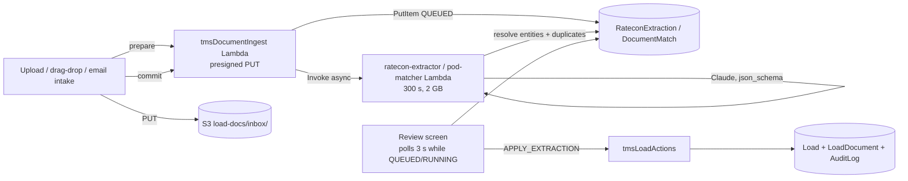

# BCAT Ops → TMS: Design (Phase 0)

> Status: **DRAFT for review.** Nothing in this document is built. Branch `feat/tms-phase-0-discovery`.
> Companion brief: `Docs/TMS_BUILD_PROMPT.md`. Every claim about current code cites `file:line` as of commit `f93e34f`.

Contents
1. What exists today (audit)
2. Corrections to the brief
3. Design principles
4. Target data model
5. GSIs
6. Server-side actions (Lambdas) and access control
7. Async document pipeline (ratecon / POD)
8. Migration plan
9. Aljex cut-over plan
10. Phase plan with schema diffs, risks, test plans
11. Open questions

---

## 1. What exists today

### 1.1 Platform
- React 19 SPA, single Zustand store (`src/store/useAppStore.ts`, no slices) plus newer poll-based hooks (`src/hooks/useFactoringItems.ts` pattern: `useState` + `setInterval(load, 30_000)`). Raw GraphQL strings via untyped `generateClient()` in `src/lib/apiClient.ts`; field lists are string constants with self-healing "pre-deploy" flags (`loadsHaveHot`, `loadsHaveStops` — `apiClient.ts` retries without a field the backend rejects).
- **No AppSync subscriptions are used anywhere in `src/`** (grep `observeQuery|onCreate|subscriptions` → none). Every live surface polls (Intake 30 s, Disputes 30 s, Calendar, AuthContext 60 s). Lambdas that write DynamoDB directly (most of them) would not fire subscriptions anyway.
- Auth: Cognito groups `ADMIN`, `DISPATCHER` (`amplify/auth/resource.ts:15`) plus dynamic `page-<key>` groups created by `userManagement`. Client guard `hasPageAccess = isOwner || ADMIN || page-<key>` (`src/context/AuthContext.tsx:132`), route guard `RequirePage` (`src/components/RequirePage.tsx`). **Server-side** enforcement exists in exactly two places: `userManagement` (owner-only) and `vendor-ap-actions/handler.ts:100-140` (`getGroups(identity)` → `isAdmin`/`page-vendorAp` check). Model-level ADMIN gates: `FactoringItem` delete, `VendorPayable` delete, `CashCheckIn`/`CashSettings` full CRUD (`amplify/data/resource.ts:441-444, 470-473, 1283-1308`).
- Audit: `AuditLog { entityType, entityId, action, user, changes: json }`, create+read only (`resource.ts:487-499`). Written from the store (`writeAudit`, 6 call sites: Load/Driver create/update/delete), `complianceClient.ts:848`, and directly by `compliance-scanner` and `onboarding-portal-api`. No GSI — the audit page lists everything.
- Deploy: every push to `main` → `ampx pipeline-deploy` (`amplify.yml`). No branch/preview environments configured. Pre-commit: lockfile guard + `tsc --noEmit`.
- 31 Lambdas (`amplify/backend.ts`): AppSync resolvers, public Function URLs (secret-authenticated Gmail/Slack bridges), EventBridge crons, one DynamoDB stream consumer (`broker-load-alert` on the Load table). `paychex-pay-sync` is defined but wired to no trigger.
- Docs: `Docs/ARCHITECTURE.md` is stale (lists retired routes, a dependency that isn't installed). `POST-DEPLOY-RUNBOOK.md` references CFN outputs (`SesDkimRecord*`) that `backend.ts` never emits.

### 1.2 Load (`amplify/data/resource.ts:19-54`, `src/types/index.ts:277-312`)
33 fields. Relevant ones:

| Field | Type | Notes |
|---|---|---|
| `aljexId` | string **required** | "Pro #" in the UI |
| `tmsId` | string **required** | "TMS ID / PO" |
| `pickupNumber` | string **required** | "PU #" |
| `customer` | string | **free-text name**, no `customerId` anywhere (grep confirmed). Batory behaviour keyed on `/batory/i` regex in 4 files |
| `stops` | json | **canonical** `Stop[]` — see below |
| `pickupAppt`, `deliveryAppt` | string **required** | legacy mirrors, dual-written from stops |
| `pickupApptEnd/Type`, `deliveryApptEnd/Type`, `originName/City`, `destinationName/City`, `pickupDriverId`, `deliveryDriverId` | string | legacy mirrors |
| `rate` | integer | **CENTS** (see §2) |
| `miles` | integer | client-side Nominatim+OSRM estimate (`LoadDrawer.tsx:113-131`) |
| `truckId` | string | Equipment.id, not editable in the drawer |
| `readyToInvoice` | boolean **required** | the only "status"; feeds calendar/grid tabs and dashboard `needsInvoice` |
| `rateConfirmKey` | string | S3 `rate-confirms/{loadId}/rate-confirm.{ext}` |
| `hot`, `unscheduled`, `colorKey`, `daySlot`, `sortOrder`, `notes`, `createdBy`, `updatedBy` | | calendar/UI |

**There is no `status`, no customer/carrier/location FK, no charges, no documents table, no check calls, no GSI on Load.** `listLoads` fetches `limit: 10000` into every client (`apiClient.ts`), the grid has no pagination.

`Stop` (`src/types/index.ts:227-266`): `id, type: 'pickup'|'delivery', name?, city?, appt, apptType?: 'exact'|'range'|'fcfs'|'tbd', apptEnd?, driverId, colorKey?, sequence` plus the Batory booking-ladder fields (`apptStatus, apptProofs, apptThreadTs, apptMoveRequested, apptMoveTaskId, apptChangeTo, apptRequestedFor, apptCleared`). One driver per stop subsumes "split loads" (`deriveSplitFromStops`, `LoadDrawer.tsx:74`).

Dual-write layer `src/lib/stops.ts`: `getStops` (reads stops or synthesizes two from legacy), `deriveLegacyFields` / `withDerivedLegacy` (stops → mirrors), `withStopsFromLegacy` (mirrors → stops; added after 26 production loads drifted). Enforced **only** in `store.addLoad/updateLoad`. ~30 files still read legacy fields directly (full list in LoadDomainScout audit; notably the calendar views, grid tabs, `useDashboardMetrics`, `fleetProfitability.ts`, `appt-report` and `broker-load-alert` Lambdas).

Write paths: `LoadDrawer.tsx` (create/edit, explicit save, zod `loadSchema`), calendar drag/resize (`SchedulerView.tsx:266-274, 496-504` write legacy driver/appt fields), grid bulk reassign (`GridPage.tsx:495`), Appts board stop edits (`updateStop → updateLoad({stops})`).

### 1.3 Directory
- `Customer { name!, contactName, contactEmail, contactPhone, notes }` (`resource.ts:375-383`). No dedupe, no GSI. Delete confirm says "Loads keep their typed name".
- `Location { name!, city, customerName, apptContactName, apptContactEmail, apptContactPhone, notes }` (`resource.ts:385-395`). Matched from a stop by **exact lower-cased name** (`LoadDrawer.tsx:498`, `ApptProofPanel.tsx:265`). No address, no lat/lng, no id on the stop.
- No geocoding helper, no address normalizer, no fuzzy matching anywhere in `src/lib`. `@vis.gl/react-google-maps` is in `package.json` with **zero imports**; `VITE_GOOGLE_MAPS_*` env vars are unused. The dashboard map is SVG d3-geo (`FleetMiniMap.tsx`).
- `/carriers` is the **Instantly.ai email-blast tool** (`CarrierContact { lane: IL_IA|IL_WI, email, ... }`, `CarrierCampaign`, `CarrierReply`) — not a carrier database. No MC/DOT/insurance fields exist.

### 1.4 Ratecon / intake
- `parseRateConfirm(fileBase64!, mediaType, todayISO): AWSJSON` → `ratecon-parser` Lambda, synchronous inside the 30 s AppSync cap (SDK timeout 24 s, `maxRetries: 0`). Model `claude-sonnet-5`, `@anthropic-ai/sdk ^0.116.0`, `messages.stream({ output_config: { effort: 'low', format: { type: 'json_schema' } } })`, secret `ANTHROPIC_API_KEY`. Output is only `{ pickup: {date,time,timeEnd}, delivery: {...} }` (`handler.ts:18-40`). Called from `src/lib/rateconUpload.ts:37` (LoadDrawer view panel + Appts board) to fill first-pickup/last-delivery appointment times on non-Batory loads.
- `IntakeItem` (Gmail/Slack/manual; `s3KeyPdfAttachments` is **always `[]`** — neither bridge captures attachments). "Build Load" opens a blank drawer and only links `builtLoadId` back (`LoadDrawer.tsx:1142-1152`); **no field is copied**.
- The reusable async ingestion pattern is `vendor-ap-intake`: `prepare` (presigned PUT per attachment, 300 s) → client uploads → `commit` (HEAD-verifies size + content type, conditional `PutItem`). S3 prefix `intake-pdfs/vendor-ap/{sha256(messageId)}/{i}-{name}.{ext}`.
- S3 bucket `bcatRateConfirms` prefixes: `rate-confirms/*`, `driver-photos/*`, `driver-pay-masters/*`, `intake-pdfs/*` (read-only to users), `appt-proofs/*`, `compliance/*`, `dispute-*`.

### 1.5 Money today (mixed units — the single largest bug source)
| Cents (integer) | Dollars (float) |
|---|---|
| `Load.rate`, `MaintenanceInvoice.amount`, `VendorPayable.amount`, `InsuranceLineItem.annualCents`, `CashFlow*` | `AmazonTrip.freightAmount`, `BoxTruckTrip.grossProfit/customerRate/carrierCost`, `DriverPayPeriod.grossPay`, `DriverPayDeduction.amount`, `DriverPayCredit.amount`, `FuelTransaction.*`, `ExpenseRecord.amount`, `RecurringExpense.monthlyAmount`, `CashCheckIn.*`, `AmazonDispute.*` |

### 1.6 Finance features
- **No customer invoice model, no invoice number, no AR.** `readyToInvoice` is a dead-end boolean.
- Factoring: `FactoringItem { id = proNumber, status NEED_TO_FACTOR|PENDING_WITH_OTR|FACTORED, subject, fromEmail, receivedAt, messageId }` from `ivanfactoring@` emails. **No load/invoice link.** "OTR" is hard-coded only as the status label.
- Vendor AP: `VendorPayable` + `manageVendorPayable` Lambda (`SEND_MAINTENANCE | UPDATE_DETAILS | COMPLETE | REOPEN`), optimistic `expectedUpdatedAt` guards, DynamoDB transaction with `MaintenanceInvoice`. **This is the model for every finance write in the TMS.**
- Driver pay: one shared calculator `calcDriverPay(trips, setting, deductions, credits, debits)` (`src/lib/driverPay.ts`) on `PayTripInput { freightAmount }` (dollars), driven by `DriverPaySetting { payGroup AMAZON|LOCAL|BOX_TRUCK, payPercent, expensesBeforePercent, fixedExpenses(json revisions), rateHistory(json) }`. **Only one pay method exists: % of gross** (before/after expenses). Trip sources: `AmazonTrip` (Sun–Sat weeks), `BoxTruckTrip` (14-day Wed→Tue anchored `2026-06-10`, `biweekly.ts:10`, already carries `loadId/aljexPro/customer/salesRep`), and `DriverPayPeriod` (Paychex lump, 14-day anchored `2026-06-08`, `payPeriods.ts:9`). Three period anchors. `useBoxTruckPay.ts:214` already derives trips from Loads (`grossProfit = rate/100`).
- Profitability: `calcFleetProfitability` attributes `Load.rate/100` to the **delivery date** and the delivery driver's `assignedTruckId` (fallback `Load.truckId`); membership from `Equipment.fleetGroup`. Profit centers are hard-coded: `cashCheckIn.ts:11-15` (`bcat` "BCAT Logistics", `ivan` "Ivan Cartage", `amazon` "Amazon DSP"), `fleetGroups.ts:5-8` (LOCAL/AMAZON/BOX_TRUCK), `branding.ts:9` `COMPANY_NAME = 'IVAN CARTAGE'`.
- Pricing margin (`/pricing-margin`) is the Best Care Auto Transport WordPress quote margin, not freight.

### 1.7 Telematics
`TruckLocation` (PK `truckId`, one row per truck, overwritten every 10 min by **two** writers: `motive-location-sync` and `blueink-sync`) + `TruckLocationHistory` (PK truckId + locatedAt, **no TTL**). Written via the DynamoDB SDK, read via AppSync `listTruckLocations`. Unmatched vehicles keyed `motive:<n>` / `blueink:<n>`.

### 1.8 Tests
`vitest run`, `environment: 'node'`, render tests start with `// @vitest-environment jsdom`, co-located `*.test.ts(x)`, mocks via `vi.hoisted` + `vi.mock('@/hooks/...')`. Pure-lib coverage is good (stops, apptStatus, apptQueue, driverPay, fleetProfitability, cashCheckIn, vendor-ap-actions, factoring-intake, vendor-ap-intake). No tests for `ratecon-parser`, `DirectoryPages`, `useDirectory`, `LoadDrawer` beyond one render test.

---

## 2. Corrections to the brief

1. **`Load.rate` is already integer cents, not whole dollars.** Evidence: `src/types/index.ts:299` (`// total load revenue in cents`), write path `LoadDrawer.tsx:1128` `Math.round(values.rate * 100)`, every reader divides by 100 (`fleetProfitability.ts:220`, `revenueAudit.ts:88`, `ExpensesPage.tsx:837`, `useBoxTruckPay.ts:214`). Production check 2026-09-28 over all 665 loads (`listLoads`, every page): every load has a rate; min 7 500, p10 35 000, median 60 000, p90 100 000, max 250 000 — i.e. $75 … $2 500 — and 286 rows are not multiples of 100 (odd cents), so no legacy whole-dollar rows exist. No boundary conversion is needed for existing data. The Aljex CSV import (§9) is where dollars → cents conversion happens.
2. **"Carrier" already means the Instantly email-blast tool** (`/carriers`, `CarrierContact`). The TMS carrier database needs a distinct model and a route decision (§11 Q8).
3. **No Google Maps is in use.** The brief says geocoding is "already used by the dashboard map"; it isn't. `@vis.gl/react-google-maps` is installed but unused; the map is SVG. We need a Google Maps Platform key (Geocoding + Places Autocomplete + Routes/Distance Matrix + Maps JS) as a new secret/env — a manual step for the runbook.
4. **The ratecon parser is synchronous and two-appointment only**; nothing about it is reusable for a full extractor except the SDK conventions. It must keep working for the Appts board (kept as-is; the new extractor is a separate Lambda).
5. **`readyToInvoice` must be kept** as a dual-written mirror of the new status (many readers), exactly like the stops mirrors.
6. **No subscriptions** exist; the review screens will poll (repo convention), not subscribe.
7. **Name collisions.** Existing `src/features/carriers/` (Carrier Blast: `CarrierContact`/`CarrierCampaign`/`CarrierReply`/`CarrierCapacitySnapshot`, `resource.ts:1005-1090`) and `src/features/invoices/` + `/invoices` (**maintenance** invoices, `MaintenanceInvoice`) are unrelated to the TMS carrier database and customer AR. New names avoid them: model `Carrier` (never `CarrierContact`), feature folder `src/features/carrier-directory/`, route per Q8; AR lives in `src/features/ar/` at `/invoicing` (page key `invoicing`), model `Invoice`, component `ArInvoicesPage` — never `/invoices`/`InvoicesPage`.
8. **No `claude-api` skill exists** in this environment (only `composio-cli`, `gooseworks`), so the brief's "check claude-api skill for model id/params" can't be followed. The extractor uses the repo's working production convention (`claude-sonnet-5`, `@anthropic-ai/sdk ^0.116.0`, streaming, `output_config.format = json_schema` — `ratecon-parser/handler.ts:57-78`, `trip-screenshot-parser/handler.ts:83-120`) and re-verifies it in the sandbox at Phase 3 start.

---

## 3. Design principles

- **Extend, mirror, backfill.** No existing field is renamed or removed. New fields on existing models are optional. Where a new canonical field supersedes an old one (`status` ⇢ `readyToInvoice`, `customerId` ⇢ `customer`, `LoadCharge` ⇢ `rate`), the old one is dual-written from the new one in **one** place (store write path or the finance Lambda), same as `withDerivedLegacy`. Backfills are `scripts/*.mjs`, dry-run by default, `--apply` to write, following `scripts/setChadPayRates.mjs` auth.
- **Money = integer cents**, field suffix `Cents`, in every new model and every new field. Pure math in `src/lib/money.ts` (`addCents`, `pctOfCents(cents, bps)` with basis points for percentages, `allocateCents` largest-remainder split). Existing dollar-float pay code is adapted at one seam (§4.13), never duplicated.
- **Every finance write goes through a Lambda** (`tmsFinanceActions`, pattern = `vendor-ap-actions`): models are `read` for authenticated, `delete` for ADMIN, all mutations via `action + input` with `expectedUpdatedAt` guards and DynamoDB transactions. ADMIN/page-group checks server-side.
- **AI proposes, people commit.** `RateconExtraction` / `DocumentMatch` records hold the proposal with per-field `{ value, confidence, sourceText }`. The only thing that creates a Load or attaches a document is a human click, which also writes an `AuditLog` row `action: 'ai_extraction_applied'` containing extracted vs. final values.
- **Snapshots on the load.** Stops store `locationId` **and** the address/name as booked; the load stores customer/carrier names as booked. Directory edits never rewrite history.
- **Keep the in-memory model bounded.** Historical Aljex loads do **not** enter the `Load` table (§9). Load lists move to GSI queries (`status`, date window) in Phase 2 so the 10 000-row scan stops growing.

---

## 4. Target data model

Notation: `field: type` · `!` required · `[]` list · `json` = AWSJSON (typed in `src/types/tms.ts`) · `→Model` = string id reference (repo has no relationships; keep that) · all money `Cents: integer`.

### 4.1 `Division` (new)
Revenue divisions replace the hard-coded profit centers.
```
key!: string            // 'BCAT_LOGISTICS' | 'IVAN_CARTAGE' | 'AMAZON_DSP' — seed; more via Settings
name!: string
legalName, mcNumber, dotNumber, scac, remitToName, remitToAddress: json, remitToEmail
invoicePrefix: string   // e.g. 'BL'
fleetGroup: enum LOCAL|AMAZON|BOX_TRUCK   // links to Equipment/Driver.fleetGroup for profitability
active!: boolean
```
Singleton config also lives here: `TmsSettings { id='default', marginFloorBps, defaultPaymentTermsDays, accessorialCodes: json[], loadStatusRules: json, invoiceNumberFormat }`.

### 4.2 `Customer` (extend)
```
+ mcNumber, dotNumber, billingEmail, billingContactName, billingPhone
+ billingAddress: json {street, city, state, zip, country}
+ paymentTermsDays: integer, creditLimitCents, creditHoldFlag: boolean
+ requiredDocsForInvoice: string[]   // ['POD','BOL','LUMPER_RECEIPT'] — LoadDocument.type keys
+ defaultDivisionKey: string, defaultSalesRepId: string
+ aliases: string[]                  // names seen on ratecons that resolve here
+ normalizedName: string             // GSI key for dedupe (lower, strip punctuation/legal suffixes)
+ active: boolean, apptWorkflow: enum NONE|BATORY   // replaces the /batory/i regex
```

### 4.3 `Location` (extend)
```
+ street, state, zip, country
+ lat: float, lng: float, timezone, geohash6: string   // 150 m dedupe uses geohash prefix + haversine
+ facilityType: enum SHIPPER|RECEIVER|BOTH|YARD|TRUCK_STOP|OTHER
+ hours, apptRule: enum FCFS|APPT|EITHER, apptLeadTimeHours, dockNotes, lumperNotes, detentionNotes
+ contacts: json[] {name, role, email, phone}
+ customerIds: string[]               // many-to-many (customerName stays as a legacy mirror = first customer's name)
+ aliases: string[], normalizedName, normalizedAddress: string
+ mergedIntoId: string                // set by the merge tool; reads follow the pointer
+ active: boolean
```

### 4.4 `Carrier` (new — outside carriers; own fleet stays Driver/Equipment)
```
name!, normalizedName, mcNumber, dotNumber, scac
dispatcherName, dispatcherPhone, dispatcherEmail, phone, email
cargoInsuranceExp, liabilityInsuranceExp, generalLiabilityExp: date
safetyRating: enum SATISFACTORY|CONDITIONAL|UNSATISFACTORY|NONE|UNKNOWN
paymentTermsDays, quickPayFeeBps, remitToName, remitToAddress: json
factoringCompanyName, factoringRemitTo: json
doNotUse: boolean, doNotUseReason
w9DocumentId, coiDocumentId: →LoadDocument (entity docs reuse LoadDocument with entityType='Carrier')
notes, active!
```
Dispatch to a carrier with any insurance date < load pickup date is refused server-side (`tmsLoadActions.ASSIGN_CARRIER`).

### 4.5 `Load` (extend — all additive)
```
+ status: enum QUOTE|TENDERED|BOOKED|DISPATCHED|AT_PICKUP|LOADED|IN_TRANSIT|AT_DELIVERY|DELIVERED|POD_RECEIVED|INVOICED|PAID|CANCELLED|TONU
+ statusChangedAt, statusHistory: json[] {status, at, by}        // "Updates" tab
+ customerId: →Customer  (customer string kept as name snapshot)
+ customerRef, bolNumber, refs: json[] {type, value}            // PO, BOL, PU#, DEL#, SO, CUST_LOAD#, PRO...
+ mode: enum FTL|LTL|PARTIAL|POWER_ONLY|BOX_TRUCK|AMAZON
+ equipmentType, weightLbs: integer, pieces: integer, commodity, tempF: float, hazmat: boolean
+ items: json[] {description, qty, weightLbs, class, dims}
+ divisionKey: string, salesRepId, serviceRepId, dispatcherAssignedId, dispatcherActualId  (→ Cognito username)
+ tariff, quoteNumber, tags: string[]
+ specialInstructions (≤420), bolNotes (≤260)                     // limits enforced in zod + Lambda
// rates (cached totals; LoadCharge rows are the detail)
+ customerRateType: enum FLAT|PER_MILE|HOURLY|PER_CWT, customerHours: float, customerLhRateCents, customerFscBps, customerFscPerMileCents, smrCents
+ carrierRateType, carrierHours, carrierLhRateCents, carrierPayBps, carrierMaxRateCents
+ customerTotalCents, carrierTotalCents, netCents, marginBps       // recomputed by tmsLoadActions.RECALC
// assignment
+ assignmentType: enum OWN_ASSET|CARRIER|BROKER_NEED_TO_COVER
+ carrierId: →Carrier, carrierName (snapshot), carrierDispatcher, carrierDriver1Name/Cell/Email, carrierDriver2Name/Cell/Email
+ carrierTruckNumber, carrierTrailerNumber, sealNumber, carrierRef, emptyFromCity, emptyFromState, emptyMiles: integer
+ puEta, confirmSentAt, confirmReceivedAt, dispatchedAt: datetime
+ driver2Id: →Driver, trailerId: →Equipment                        // own asset; driver1 = stops[].driverId, truckId exists
// tracking
+ trackingProvider: enum NONE|MOTIVE|DRIVER_APP|LINK|MACROPOINT|TRUCKER_TOOLS, trackingStatus, trackingStartAt, trackingDurationHours, trackingIntervalMin, trackingLastUpdateAt, trackingExternalId
+ nextCheckCallAt, nextCheckCallNote
// invoicing links
+ invoiceId: →Invoice, invoicedAt, paidAt
+ laneKey: string           // 'CITY|ST>CITY|ST' from first pickup/last delivery snapshot; laneKey3 = zip3 fallback
+ source: enum MANUAL|RATECON|INTAKE|IMPORT, rateconExtractionId
```
Mirrors maintained by the store write path (`src/lib/loadMirrors.ts`, next to `stops.ts`): `readyToInvoice = status ∈ {POD_RECEIVED, INVOICED, PAID}`; `rate = customerTotalCents`; `customer = Customer.name`. `LoadDrawer` toggling RTI sets `status = POD_RECEIVED` (or back to `DELIVERED`).

**Stop (json, extended — no schema change):**
```
+ locationId: →Location
+ address: {street, city, state, zip, country, lat, lng, timezone}   // snapshot at booking
+ refs: json[] {type, value}, contact: {name, phone, email}
+ arrivedAt, departedAt: datetime, pieces, weightLbs, instructions
```
`name`/`city` stay as the display snapshot, so every existing reader keeps working.

### 4.6 `LoadCharge` (new)
```
loadId!: →Load, side!: enum CUSTOMER|CARRIER, code!: string   // LINEHAUL|FSC|DETENTION|LAYOVER|LUMPER|TONU|STOP_OFF|DRIVER_ASSIST|... from TmsSettings.accessorialCodes
description, qty: float, rateCents, amountCents!: integer, release: boolean, sortOrder: integer, createdBy
```
One row per Aljex accessorial line. LINEHAUL rows are written from the rate-type fields; totals cached on Load.

### 4.7 `CheckCall` (new)
```
loadId!, at!: datetime, city, state, lat, lng, tempF, note, message: enum ON_TIME|LATE|ARRIVED|LOADED|DEPARTED|DELIVERED|BREAKDOWN|OTHER
ediReason: string ('NS' default), source: enum MANUAL|MOTIVE|DRIVER_APP|PROVIDER, enteredBy, stopId, nextAt, nextNote
```
Driver-app status buttons and Motive pings write CheckCalls; `Load.nextCheckCallAt` is the worklist key.

### 4.8 `LoadDocument` (new — one document store for loads, carriers, invoices)
```
entityType!: enum LOAD|CARRIER|INVOICE|CARRIER_BILL, entityId!, loadId (denormalized for LOAD/INVOICE)
type!: enum CUSTOMER_RATECON|CARRIER_RATECON|BOL|POD|LUMPER_RECEIPT|SCALE_TICKET|INVOICE|CARRIER_INVOICE|W9|COI|OTHER
visibility!: enum PUBLIC|PRIVATE, s3Key!, name!, contentType!, sizeBytes!, pages
uploadedBy!, source!: enum UPLOAD|EMAIL|RATECON|POD_MATCH|DRIVER_APP|GENERATED, extractionId, sha256
```
S3 prefix `load-docs/{loadId}/{documentId}-{name}` (new storage rule: authenticated r/w, delete via Lambda only). `Load.rateConfirmKey` is mirrored to the current `CUSTOMER_RATECON` key. `ComplianceDocument` (driver/truck files) stays separate.

### 4.9 `RateconExtraction` (new)
```
status!: enum QUEUED|RUNNING|REVIEW|APPLIED|DISCARDED|FAILED
s3Key!, contentType!, sizeBytes, pages, uploadedBy!, source: enum UPLOAD|EMAIL|INTAKE, intakeItemId
model, promptVersion!, startedAt, finishedAt, error, tokensIn, tokensOut
extracted: json          // ExtractedRatecon (schema in §7) — every field {value, confidence 0-1, sourceText, page}
resolved: json           // {customerId, customerMatch: {score, candidates[]}, stops[]: {locationId, match: {...}}, duplicateLoadIds[]}
brokerKey: string        // normalized broker/customer name for accuracy stats
loadId: →Load, appliedBy, appliedAt, corrections: json   // {field: {extracted, final}} written on apply
```

### 4.10 `DocumentMatch` (new — POD and other paperwork)
```
status!: enum QUEUED|RUNNING|AUTO_ATTACHED|REVIEW|ATTACHED|REJECTED|FAILED
s3Key!, contentType!, uploadedBy, source: enum UPLOAD|EMAIL|DRIVER_APP, driverId, truckId
docType: enum POD|BOL|LUMPER_RECEIPT|SCALE_TICKET|OTHER (extracted)
extracted: json          // {refs[], shipperName, consigneeName, consigneeAddress, deliveryDate, signaturePresent, receiverName, exceptions[], sealNumbers[]}
candidates: json[]       // [{loadId, score, reasons[]}] top 3
loadId, documentId: →LoadDocument, decidedBy, decidedAt, flags: string[]   // OSD, MISSING_SIGNATURE
```

### 4.11 AR: `Invoice`, `InvoiceLine`, `Payment`
```
Invoice: number!: string (unique via Sequence), customerId!, customerName, divisionKey!, status!: enum DRAFT|ISSUED|PARTIAL|PAID|VOID|WRITTEN_OFF
  issuedAt, dueAt, termsDays, subtotalCents!, taxCents, totalCents!, paidCents!, balanceCents!, writtenOffCents
  remitTo: json (ours or the factor's), factoringBatchId, factored: boolean, pdfDocumentId, sentAt, sentTo, notes: json[] {at, by, text}
  loadIds: string[], createdBy, issuedBy, voidedBy, voidReason
InvoiceLine: invoiceId!, loadId!, chargeId: →LoadCharge, code!, description, amountCents!, sortOrder
Payment: customerId!, receivedAt!, method!: enum CHECK|ACH|WIRE|CARD|CREDIT_MEMO|FACTOR_ADVANCE|OTHER, reference, amountCents!
  applications!: json[] {invoiceId, amountCents}, unappliedCents, kind: enum PAYMENT|CREDIT_MEMO|SHORT_PAY|WRITE_OFF, createdBy, notes
Sequence: id ('invoice:BL'), next: integer      // Lambda-only conditional increment
```
Aging = pure function over `Invoice{status, issuedAt, dueAt, balanceCents}` (`src/lib/arAging.ts`), buckets CURRENT|D1_30|D31_60|D61_90|D90_PLUS, DSO.

### 4.12 Factoring: `FactoringCompany`, `FactoringBatch`
```
FactoringCompany: name!, advanceBps!, feeSchedule: json[] {uptoDays, feeBps}, reserveBps!, recourseDays, remitTo: json, submissionMethod: enum EMAIL|PORTAL|CSV, submissionEmail, divisionKeys: string[], active!
FactoringBatch: factoringCompanyId!, number!, status!: enum DRAFT|SUBMITTED|ADVANCED|SETTLED|CLOSED, invoiceIds: string[], submittedAt, submittedBy
  faceCents!, expectedAdvanceCents!, expectedFeeCents!, expectedReserveCents!, advanceReceivedCents, advanceReceivedAt, feesChargedCents, reserveReleasedCents, reserveReleasedAt, chargebacks: json[] {invoiceId, amountCents, at, reason}, scheduleDocumentId, notes
FactoringItem (existing): + invoiceId, + loadId   // linked by PRO ⇢ Load.aljexId at intake and at invoice issue
```
Math in `src/lib/factoring.ts`: `advance = pctOfCents(face, advanceBps)`, `fee = pctOfCents(face, feeBpsForDays(days))`, `reserve = face − advance − fee`; reconciliation = expected vs received per batch. The Cash Check-in factoring scenario reads real batch numbers when present.

### 4.13 AP: `CarrierBill`, `Advance`
```
CarrierBill: loadId!, carrierId!, carrierName, status!: enum PENDING_DOCS|APPROVED|SCHEDULED|PAID|DISPUTED|VOID
  grossCents! (= Load.carrierTotalCents), advancesCents!, quickPay: boolean, quickPayFeeCents, netCents!, dueAt, termsDays
  requiredDocs: string[], missingDocs: string[], carrierInvoiceDocumentId, remitTo: json (carrier or its factor), vendorPayableId: →VendorPayable, notes: json[], approvedBy, approvedAt, paidAt, paymentMethod, paymentReference
Advance: loadId!, carrierId, driverId, kind!: enum FUEL|COMCHECK|CASH|OTHER, amountCents!, feeCents, issuedAt!, issuedBy!, reference, deductedInBillId, deductedInSettlementPeriod, notes
```
When a bill is APPROVED it is pushed into the existing Vendor AP queue via `manageVendorPayable` (new action `SEND_CARRIER_BILL`, id `carrier-bill:<billId>`); paying it there closes the bill in the same transaction. One payment queue, as the brief prefers.

### 4.14 Settlements & commissions
Driver pay reuses `calcDriverPay` untouched. Two additive changes:
- `DriverPaySetting` **+** `payMethod: enum PERCENT|PER_MILE|FLAT_PER_LOAD|HOURLY|PER_STOP` (null ⇒ PERCENT, today's behaviour), `+ rateCents: integer` (per mile / flat / hourly / per stop), `+ teamSplitBps`. `tripPayAmount(trip, setting)` gains a `method` branch; trips carry `miles`, `hours`, `stops` for the new methods. Rate history pins `payMethod` + `rateCents` alongside `payPercent`.
- **`SettlementLine` (new)**: `driverId!, payGroup!, periodStart!, loadId!, stopIds: string[], role: enum DRIVER1|DRIVER2, basisCents!, method!, rateCents, miles, hours, payCents!, status!: enum DRAFT|POSTED|PAID, postedAt, statementPeriodId, source: enum LOAD|MANUAL`. GSI `periodStart+driverId` (same as trips). The LOCAL/brokered-own-driver fleets feed statements from `SettlementLine`; Amazon (`AmazonTrip`) and Box Truck (`BoxTruckTrip`) keep their CSV/screenshot sources, with `BoxTruckTrip` rows generated from Loads where `loadId` is set (it already has the column). The seam `src/lib/settlementAdapter.ts` converts `SettlementLine.payCents → PayTripInput.freightAmount` (dollars) so the calculator, credits, debits, fixed expenses, and PDFs stay shared.
- `CommissionRule: repId!, basis!: enum GROSS_MARGIN|REVENUE, rateBps!, paidOn!: enum INVOICED|PAID, customerId (override), divisionKey, effectiveFrom!, effectiveUntil`. `CommissionEntry: repId!, invoiceId!, loadId!, ruleId!, basisCents!, rateBps!, amountCents!, period (YYYY-MM), status: enum ACCRUED|PAYABLE|PAID`. Written by the finance Lambda on invoice issue / payment.

### 4.15 Rate history: `LaneRateSample` (new)
```
laneKey! ('CHICAGO|IL>DANVILLE|IL'), laneKey3 ('606>618'), date!, customerRateCents, carrierRateCents, miles, customerId, customerName, carrierId, carrierName, divisionKey, equipmentType, loadId, source!: enum LOAD|ALJEX_IMPORT
```
Fed by a Load-table stream consumer (`load-stream-projector`, same wiring as `broker-load-alert`) on DELIVERED+, and by the Aljex import. The Historical Rates panel is `src/lib/laneStats.ts` (avg/low/median/high/volume/miles per window) over one GSI query.

### 4.16 Tracking / driver app
`Load.tracking*` fields (above) + `TrackingEvent` is **not** a new model: provider pings become `CheckCall{source: PROVIDER|DRIVER_APP|MOTIVE}`. Driver app accounts: Cognito group `DRIVER` + `page-driverApp`; `Driver.cognitoUsername` added so a driver's load list is `loads where stops[].driverId = me` (served by a Lambda projection, never a raw table grant).

---

## 5. GSIs

DynamoDB allows 20 GSIs per table; Load gets 6. All are Amplify `secondaryIndexes` with explicit `queryField` names (the repo currently uses defaults; naming them keeps `apiClient` strings readable).

| Model | pk | sk | queryField | Serves |
|---|---|---|---|---|
| Load | `status` | `pickupAppt` | `loadsByStatus` | grid tabs, dispatch worklists, bounded client list |
| Load | `customerId` | `pickupAppt` | `loadsByCustomer` | customer page, duplicate check (customerId + customerRef filter) |
| Load | `carrierId` | `pickupAppt` | `loadsByCarrier` | carrier page, Smart Search |
| Load | `divisionKey` | `deliveryAppt` | `loadsByDivision` | reporting |
| Load | `salesRepId` | `deliveryAppt` | `loadsBySalesRep` | commissions, reporting |
| Load | `nextCheckCallAt` | — | `loadsByNextCheckCall` | overdue check-call worklist (pk = day bucket `YYYY-MM-DD`, filter time) |
| LoadCharge | `loadId` | `sortOrder` | `chargesByLoad` | |
| CheckCall | `loadId` | `at` | `checkCallsByLoad` | |
| LoadDocument | `entityId` | `createdAt` | `documentsByEntity` | + `loadId` GSI for invoice packet |
| LoadDocument | `sha256` | — | `documentsByHash` | duplicate upload detection |
| RateconExtraction | `status` | `createdAt` | `extractionsByStatus` | review queue |
| DocumentMatch | `status` | `createdAt` | `matchesByStatus` | matching queue |
| Invoice | `customerId` | `issuedAt` | `invoicesByCustomer` | |
| Invoice | `status` | `dueAt` | `invoicesByStatus` | aging (open statuses only) |
| Invoice | `number` | — | `invoiceByNumber` | uniqueness check + lookup |
| InvoiceLine | `invoiceId` | `sortOrder` | | |
| Payment | `customerId` | `receivedAt` | | |
| FactoringBatch | `factoringCompanyId` | `submittedAt` | | |
| CarrierBill | `status` | `dueAt` | `billsByStatus` | AP aging |
| CarrierBill | `carrierId` | `createdAt` | | |
| Advance | `loadId` | — | | |
| SettlementLine | `periodStart` | `driverId` | `settlementLinesByPeriod` | mirrors `BoxTruckTrip` |
| SettlementLine | `loadId` | — | | |
| CommissionEntry | `repId` | `period` | | |
| LaneRateSample | `laneKey` | `date` | `lanesByKey` | Historical Rates |
| LaneRateSample | `laneKey3` | `date` | `lanesByZip3` | fallback |
| Customer | `normalizedName` | — | | dedupe |
| Location | `normalizedName` / `geohash6` | — | | dedupe (two GSIs) |
| Carrier | `mcNumber` / `normalizedName` | — | | dedupe, ratecon resolution |
| AuditLog | `entityId` | `createdAt` | `auditByEntity` | load "Updates" tab (today's page scans everything) |

Adding a GSI to an existing table is an in-place CloudFormation update (backfilled by DynamoDB). Adding an index on a **new** attribute of an existing model is fine; rows without the attribute simply aren't in the index — which is why every backfill must run before the UI switches to the indexed query.

---

## 6. Server-side actions and access control

Two dispatcher Lambdas, same shape as `manageVendorPayable(action, id, input)`:

**`tmsLoadActions`** (page `loads`; some actions ADMIN): `SET_STATUS`, `ASSIGN_CARRIER` (insurance/doNotUse check), `ASSIGN_ASSET`, `UNCOVER`, `RECALC_CHARGES` (writes charges + cached totals + `rate` mirror atomically), `SEND_RATE_CONF`, `SEND_INFO`, `ADD_CHECK_CALL`, `ATTACH_DOCUMENT`, `DELETE_DOCUMENT` (ADMIN or uploader), `APPLY_EXTRACTION` (creates Load + docs + audit in one transaction), `DECIDE_MATCH`, `MERGE_LOCATIONS` (repoints stops in every affected load; ADMIN).

**`tmsFinanceActions`** (page `invoicing` / `carrierPay`; every money-committing action **ADMIN-only**, enforced with the `getGroups` helper copied into `amplify/functions/_shared/auth.ts`): `CREATE_INVOICE` (validates `requiredDocsForInvoice`, allocates number, snapshots lines, sets loads INVOICED), `ISSUE`, `VOID`, `RECORD_PAYMENT` (applications + balances in one `TransactWriteItems`), `CREDIT_MEMO`, `WRITE_OFF`, `CREATE_FACTORING_BATCH`, `RECORD_ADVANCE_RECEIVED`, `RELEASE_RESERVE`, `CHARGEBACK`, `APPROVE_CARRIER_BILL` (→ Vendor AP), `ISSUE_ADVANCE`, `POST_SETTLEMENT_LINES`, `POST_COMMISSIONS`.

Model authorization for every new finance model (`Invoice`, `InvoiceLine`, `Payment`, `Sequence`, `FactoringCompany`, `FactoringBatch`, `CarrierBill`, `Advance`, `SettlementLine`, `CommissionRule`, `CommissionEntry`): `allow.authenticated().to(['read'])`, `allow.groups(['ADMIN']).to(['delete'])`; writes only through the Lambda's IAM role — server-enforced. `Load`, `LoadCharge`, `CheckCall`, `LoadDocument` stay `allow.authenticated()` so dispatch keeps editing through the store. Consequence, stated plainly: the load's rate fields and cached totals (`customerTotalCents` etc.) are Lambda-written **by convention only** (`serializeLoadInput` strips them; `RECALC_CHARGES` is the sole writer), not by an authorization rule. That matches today's `Load.rate` (dispatcher-entered, unenforced); money is only *committed* — invoiced, paid, factored, settled — through the ADMIN-only finance Lambda, and that boundary is the enforced one.

New page keys (each a `page-<key>` group, added to `PERMISSION_PAGES`): `carrierDirectory`, `invoicing`, `carrierPay`, `docMatching`, `map`, `reports`, `settlements` (own-driver statements), `driverApp` (+ Cognito group `DRIVER`).

Every AI decision → `AuditLog { entityType: 'RateconExtraction'|'DocumentMatch', action: 'ai_extracted'|'ai_auto_attached'|'ai_extraction_applied', user: 'ratecon-extractor'|<email>, changes }`.

---

## 7. Async document pipeline


- Upload uses the `vendor-ap-intake` two-phase protocol, authenticated (AppSync mutation `tmsDocumentIngest`, not a public URL). Email intake: `gmail-task-intake` gains attachment capture (today `s3KeyPdfAttachments` is always `[]`) and a `ratecons@`-style inbox routes straight to `QUEUED`.
- Extractor: Anthropic SDK per repo convention (`claude-sonnet-5`, streaming, `output_config.format = json_schema`) with `max_tokens` sized for the schema (~8 000), PDF sent as a `document` block; > 20 pages ⇒ split with `pdf-lib` and extract per chunk, merge by stop order. `promptVersion` on every record so accuracy stats are per prompt × broker.
- `ExtractedRatecon` JSON schema (per-field `{value, confidence, sourceText, page}`): `broker {name, mc, contact{name,email,phone}}`, `customerLoadNumber`, `refs[] {type,value}`, `stops[] {type, facilityName, address{street,city,state,zip}, apptType, apptStart, apptEnd, refs[], contact, instructions}`, `commodity`, `weightLbs`, `pieces`, `equipment`, `tempF`, `hazmat`, `charges[] {code, description, amountCents}`, `totalCents`, `paymentTermsDays`, `quickPay {feeBps, days}`, `specialInstructions`.
- Resolution: customer by `mcNumber` then `normalizedName` then alias (score); location by `normalizedAddress` → geohash6 neighbours + haversine < 150 m → fuzzy name (Jaro-Winkler, `src/lib/fuzzy.ts`, pure + tested); duplicate loads via `loadsByCustomer` + `customerRef`.
- POD matching score (`src/lib/podMatch.ts`, pure): ref-number exact hit +50 each (max 100), consignee location match +25, delivery date within ±2 days +15 (decays), driver/truck match +10. Auto-attach iff top ≥ 90 **and** second ≤ top − 30; else REVIEW with top 3 + reasons. OS&D / missing signature ⇒ `flags` + load tag + IntakeItem task for the sales rep (existing task mechanism).
- Eval: `scripts/evalRatecons.mjs` runs the extractor over `tests/fixtures/ratecons/*.pdf` + `*.expected.json`, prints per-field accuracy per broker. Fixtures are gitignored if they contain real customer data (decision needed, Q9).

---

## 8. Migration plan (existing data)

Every script: `node scripts/<name>.mjs [--apply]`, dry-run prints a diff table, signs in with `BCAT_EMAIL`/`BCAT_PASSWORD` like `setChadPayRates.mjs`, pages with `nextToken`, is idempotent, and writes an `AuditLog` row per changed record (`user: 'migration:<script>'`).

| Phase | Script | Does | Reversible? |
|---|---|---|---|
| 1 | `backfillCustomers.mjs` | Distinct `Load.customer` (trimmed/normalized) → match or create `Customer`; set `normalizedName`, `apptWorkflow = BATORY` for `/batory/i` matches; write `Load.customerId`. `customer` string untouched. | yes (clear `customerId`) |
| 1 | `backfillLocations.mjs` | Distinct `(stop.name, stop.city)` → geocode (Google), match existing Location by normalized name / 150 m, else create; write `stop.locationId` + `stop.address` snapshot into `stops` JSON via `updateLoad` (dual-write stays intact because `stops` is canonical). Unresolvable rows listed for manual fix in the Locations merge tool. | yes |
| 2 | `backfillLoadStatus.mjs` | `readyToInvoice → POD_RECEIVED`; else last delivery `departedAt`/appt in the past → `DELIVERED`; else any driver/carrier → `DISPATCHED`; else `BOOKED`. Also `customerTotalCents = rate`, one `LoadCharge{LINEHAUL, CUSTOMER, amountCents = rate}`, `laneKey`, `divisionKey` from the delivery driver's `fleetGroup` (LOCAL→IVAN_CARTAGE, AMAZON→AMAZON_DSP, BOX_TRUCK→IVAN_CARTAGE, broker-covered→BCAT_LOGISTICS — confirm Q1). | yes |
| 2 | `backfillLoadDocuments.mjs` | `rateConfirmKey` → `LoadDocument{CUSTOMER_RATECON}` (copy object to `load-docs/`, keep original). | yes |
| 5 | `linkFactoringItems.mjs` | `FactoringItem.proNumber` ⇢ `Load.aljexId` → `loadId`; `invoiceId` when invoices exist. | yes |
| 6 | `seedDivisions.mjs`, `seedAccessorialCodes.mjs` | Seed rows from the hard-coded lists. | n/a |

Rules: no field rename/delete in any phase. The only schema edits to existing models are additive optional fields, the `Load` GSIs, and `DriverPaySetting.payMethod/rateCents/teamSplitBps`. `CashFlowInputs/CashFlowWeekLog/DocumentSignatureRequest` stay untouched (already orphaned).

**Client-side migration risks**
- `apiClient` field-flag pattern: every new Load field must be added to `loadFields()` behind a flag until the backend deploys, or `listLoads` breaks for everyone on `main` between backend and frontend deploy. Same for the new models' list queries.
- The 26-load drift incident shows any new write path that bypasses `store.updateLoad` re-creates divergence. Rule: the new `tmsLoadActions` Lambda imports `deriveLegacyFields` (moved to `amplify/functions/_shared/stops.ts`, re-exported from `src/lib/stops.ts` so tests stay put) and computes mirrors server-side too.

---

## 9. Aljex cut-over plan

1. **Exports needed from Aljex** (CSV): loads (all statuses, all years — for lane history), customers, locations/facilities, carriers, accessorial codes, AR open invoices, AP open bills, sales-rep list. Confirm availability (Q3).
2. **Import scripts** (`scripts/aljex/`):
   - `importCustomers.mjs`, `importLocations.mjs` (geocode, dedupe with the same `src/lib/fuzzy.ts` + geohash rules, produce a review CSV of near-duplicates), `importCarriers.mjs` (dedupe by MC).
   - `importLaneHistory.mjs`: historical loads → **`LaneRateSample` only**, dollars → cents at import. Historical loads are **not** created as `Load` rows (keeps `listLoads`, the calendar and every legacy reader bounded). If we need them searchable, `LaneRateSample` carries the Aljex load number and the Historical Rates panel links to it.
   - `importOpenLoads.mjs`: only loads not yet delivered or not yet invoiced at cut-over → real `Load` rows (`source: IMPORT`, `aljexId` set, charges from the export) — expected < 200.
   - `importOpenAR.mjs` / `importOpenAP.mjs`: open invoices/bills as `Invoice{status ISSUED, source import}` / `CarrierBill` so aging is complete from day one.
3. **Parallel run**: two weeks after Phase 5, new loads built in both; nightly `scripts/aljex/reconcile.mjs` compares counts/totals by `aljexId`.
4. **Cut-over checklist** (runbook entry): freeze Aljex writes, run open-loads/AR/AP imports, verify totals, switch `/loads` grid default to the GSI query, announce.
5. Rate history note: samples before cut-over show `source: ALJEX_IMPORT` in the panel; stats treat both sources equally.

---

## 10. Phase plan

Each phase: branch `feat/tms-phase-N-<name>`, plan → approval → build → `npm run build && npm run lint && npm run test` green → browser preview + screenshots → PR. Quality gate details per phase below. Docs updated per phase: CONTEXT.md routes/models/Lambdas, WORKFLOWS.md bullet, POST-DEPLOY-RUNBOOK.md entry for any secret/migration/manual step.

**Infrastructure decision needed before Phase 1 (Q10):** schema changes on a feature branch can't be exercised against production. Options: (a) `npx ampx sandbox` per developer (isolated backend, cheapest, what Amplify Gen 2 expects), (b) an Amplify **branch environment** for `feat/*` (auto-deploys the branch's own backend + preview URL). Recommend (b) for review screenshots on a real URL plus (a) for iteration; both need the secrets copied.

### Phase 1 — Locations & Customers
- Schema: `Customer` + `Location` fields (§4.2, §4.3), `Division`, `TmsSettings`, GSIs on `normalizedName`/`geohash6`; `Load.customerId`; Stop JSON extensions (no schema change).
- Lambdas: `tmsGeocode` (Google Geocoding + Places Autocomplete proxy; key in `GOOGLE_MAPS_API_KEY` secret; caches by normalized address in `GeocodeCache` model so we never pay twice); `tmsLoadActions.MERGE_LOCATIONS`.
- UI: Locations page rebuilt (address, map pin, hours, contacts, customers, aliases, merge tool with "N loads will be repointed"); Customers page (billing, terms, credit, required docs); LoadDrawer customer + facility **pickers** with "Matches existing: X (98%)" chooser and inline create; `/batory/i` replaced by `Customer.apptWorkflow` (regex kept as fallback until backfill done).
- Migrations: `backfillCustomers`, `backfillLocations`, `seedDivisions`.
- Tests: `src/lib/fuzzy.test.ts`, `normalizeAddress.test.ts`, `locationDedupe.test.ts` (150 m rule, alias, merge repointing), render tests for both pages + picker; `tmsGeocode` handler test with mocked Google.
- Risks: geocode cost/quotas on the backfill (cache + batch); the Batory regex→flag switch must be atomic with the customer backfill; Nominatim/OSRM miles calc replaced by Google Routes (behaviour change: miles may differ slightly).

### Phase 2 — Load record v2
- Schema: `Load` additive fields (§4.5) + 6 GSIs; `Carrier`; `LoadCharge`; `CheckCall`; `LoadDocument`; `AuditLog` GSI; storage rule `load-docs/*`.
- Lambdas: `tmsLoadActions` (all non-AI actions), `load-stream-projector` (lane samples + `readyToInvoice`/`rate` mirror integrity check + status history), `tmsDocumentIngest` (upload only; no AI yet).
- UI: Load page as collapsible sections mirroring Aljex rows (Header/Roles, Stops with insert/drag, Rates + accessorial grid + Net/Profit box + margin-floor/max-rate warnings, Carrier/Asset assignment with insurance block, More Info tabs incl. char-limited notes and Updates timeline from `auditByEntity`, Documents public/private, Check calls + overdue worklist, Historical Rates panel). Keyboard-first: autosave per section via `updateLoad` debounce with optimistic state + conflict toast on `updatedAt` mismatch. Grid: GSI-backed status tabs, filters by division/rep/dispatcher/customer/carrier/driver/tags, saved views. `/carrier-directory` page (or `/carriers`, Q8). `LoadDrawer` stays for calendar quick-edit and is fed by the same form pieces.
- Migrations: `backfillLoadStatus`, `backfillLoadDocuments`.
- Tests: `loadCharges.test.ts` (totals, FSC per-mile vs %, per-cwt, hourly, net/margin bps, rounding), `laneStats.test.ts` (windows, median, zip3 fallback), `loadStatus.test.ts` (allowed transitions, mirror derivation), `carrierEligibility.test.ts`; Lambda tests for `RECALC_CHARGES` and `ASSIGN_CARRIER`; render tests: load page sections, grid filters.
- Risks: biggest UI surface; legacy readers (calendar, profitability) keep reading `rate`/`readyToInvoice` — mirrors must be right from day one; `listLoads` switch from full scan to status/date-window query changes what the calendar can see (keep a "load older" path).

### Phase 3 — Ratecon auto-build
- Schema: `RateconExtraction`; `Customer.aliases` usage; `IntakeItem.s3KeyPdfAttachments` finally populated.
- Lambdas: `ratecon-extractor` (300 s, 2 GB, async-invoked), `gmail-task-intake` attachment capture, `tmsLoadActions.APPLY_EXTRACTION`.
- UI: drop zone on Loads page + Intake "Extract"; Review screen (PDF.js viewer left, prefilled load form right, confidence colouring, source-snippet hover, entity-resolution choosers, duplicate warning, "Create load"); Extraction queue tab; accuracy report page under `/reports`.
- Tests: extractor prompt/schema snapshot test, `resolveEntities.test.ts`, `extractionDiff.test.ts` (corrections capture), handler test with a fixture PDF and mocked Anthropic; `scripts/evalRatecons.mjs`.
- Risks: model id/params are the repo's convention (`claude-sonnet-5`, `output_config`) — verify against the installed SDK in a sandbox first; multi-page cost; PII in fixtures.

### Phase 4 — Invoicing, AR aging, payments
- Schema: `Invoice`, `InvoiceLine`, `Payment`, `Sequence`; `Load.invoiceId/invoicedAt/paidAt`; `Customer` credit fields used.
- Lambdas: `tmsFinanceActions` (AR actions), `invoice-pdf` (server-side PDF via `pdf-lib`, already a dependency; branded per Division; remit-to switch for factored), `invoice-emailer` (SES, attaches docs from `LoadDocument`).
- UI: `/invoicing` (build from selected loads, consolidated per customer, required-docs gate with missing list, issue/void/notes), invoice detail, payments (apply/short-pay/credit memo/write-off), AR aging by customer/division/rep with drill-down + CSV, credit-limit warning in the load page.
- Tests: `arAging.test.ts` (bucket boundaries, DSO), `invoiceBuild.test.ts` (line snapshot, totals, required docs), `paymentApply.test.ts` (partial, over-application rejected, credit memo), Lambda transaction tests.
- Risks: numbering format/terms defaults (Q5); SES sender for billing (runbook); ADMIN-only enforcement must not lock out the person who actually bills (page grant `invoicing` for prepare, ADMIN for issue — confirm).

### Phase 5 — Factoring + Carrier AP
- Schema: `FactoringCompany`, `FactoringBatch`, `FactoringItem.+invoiceId/loadId`, `CarrierBill`, `Advance`, `VendorPayable.source + CARRIER_BILL`.
- Lambdas: `tmsFinanceActions` factoring + AP actions; `manageVendorPayable.SEND_CARRIER_BILL`; schedule-of-accounts export (CSV + PDF) and email.
- UI: `/factoring` gains Companies, Batches (build from ISSUED invoices, export/email, record advance/fees/reserve/chargebacks, reconciliation expected-vs-received), the existing PRO queue rows now link to invoices; `/carrier-pay` (bills, required docs, quick-pay toggle, advances issue/view, AP aging); Cash Check-in factoring scenario reads batch data.
- Migrations: `linkFactoringItems`.
- Tests: `factoring.test.ts` (advance/fee schedule/reserve/recourse, rounding to cents with largest-remainder), `carrierBill.test.ts` (advances + quick-pay netting), Lambda tests.
- Risks: factor terms unknown (Q2); Vendor AP queue semantics for a carrier bill vs a maintenance invoice (payment method list may differ).

### Phase 6 — Settlements, commissions, reporting
- Schema: `DriverPaySetting.payMethod/rateCents/teamSplitBps`, `SettlementLine`, `CommissionRule`, `CommissionEntry`, `Division` usage everywhere.
- Lambdas: `tmsFinanceActions.POST_SETTLEMENT_LINES` / `POST_COMMISSIONS`; `load-stream-projector` creates DRAFT lines on DELIVERED for own-driver loads.
- UI: `/settlements` (LOCAL fleet statements reusing the box-truck statement components; lines per load, credits/debits/deductions unchanged), commission report per period, `/reports` dashboards (division/rep/dispatcher/customer/carrier/driver/lane/date; revenue, cost, margin $/%, loads, RPM/CPM, on-time %, AR aging, top lanes) — built on `calcFleetProfitability` inputs plus Load charges, not a second engine.
- Tests: `driverPay.test.ts` extended for each `payMethod` + team split; `settlementAdapter.test.ts` (cents→dollars seam, no double counting with BoxTruckTrip); `commission.test.ts` (basis, overrides, paid-on rules); `reporting.test.ts` slices.
- Risks: pay methods per fleet unknown (Q4); the three period anchors — settlement lines follow `payGroup`'s existing anchor, no unification in this phase.

### Phase 7 — POD matching
- Schema: `DocumentMatch`. Lambdas: `pod-matcher` (extract + score), `tmsLoadActions.DECIDE_MATCH`. UI: `/doc-matching` queue with top-3 candidates and reasons, exceptions flags → load tag + rep task. Attach ⇒ `POD_RECEIVED` ⇒ invoice-ready.
- Tests: `podMatch.test.ts` (scoring, thresholds, tie rule), extraction schema snapshot, handler test with fixture PODs.

### Phase 8 — Tracking, map, generated forms
- Map page (`@vis.gl/react-google-maps`, already installed): active loads' stops + `TruckLocation`, colour by status, click-through. Own trucks: Motive position + ETA (Routes API). Carrier tracking: `TrackingProvider` interface (`start/stop/update/status`) with `LINK` (SMS/email tokenised page writing CheckCalls) and `DRIVER_APP` implementations; MacroPoint/Trucker Tools stubs behind the interface (Q6). Motive pings → automatic CheckCalls.
- Forms: `pdf-lib` templates per Division: BOL, Invoice (from Phase 4), Pick Up / Delivery Confirmation, Check Call Report, Customer Confirmation, Carrier Confirmation (our ratecon), Pick Up / Consignee Information, Advance receipt; "Send Rate Conf"/"Send Info" via SES with the PDF; generated forms stored as `LoadDocument{source: GENERATED}`.
- Tests: form data mappers (pure), provider interface contract tests, `TruckLocationHistory` TTL added (runbook).

### Phase 9 — Driver PWA
- `/driver/*` route group inside the repo, Cognito `DRIVER` group, `Driver.cognitoUsername`; `driver-app-api` Lambda projection (assigned loads, stop details, status buttons → CheckCall + Load status, camera capture → `DocumentMatch`, location pings → CheckCall, statements). Manifest + service worker (Vite PWA plugin), mobile-first shell. The API surface is designed in Phases 2/7/8 so this phase is a client.

---

## 11. Open questions (blocking the phase indicated)

1. **(P1/P2)** Exact revenue divisions and their legal/remit-to details; sales rep list (are reps Cognito users? commission on gross margin or revenue, paid on invoiced or paid?). Default mapping for existing loads (§8) OK?
2. **(P5)** Factoring company (OTR Solutions?) advance %, fee schedule by days, reserve %, recourse window, submission method. Factor only Ivan Cartage invoices, or BCAT Logistics too?
3. **(P2/P9 cut-over)** Replacing Aljex entirely? Which CSV exports can we get (loads history, customers, facilities, carriers, open AR/AP)?
4. **(P6)** Pay methods by fleet for LOCAL/OTR drivers (per mile / % / flat / hourly / per stop) and team split rule.
5. **(P4)** Required documents per customer before invoicing; invoice number format (proposal: `<DivisionPrefix>-<YYYY>-<00001>`); default payment terms (30 days?); billing email sender address for SES.
6. **(P8)** Tracking provider preference — MacroPoint, Trucker Tools, or driver app + link only for now?
7. **(P4+)** Accounting export target (QuickBooks Online?) — affects `Invoice`/`Payment`/`CarrierBill` export fields and a future `qbo-sync` Lambda; not modelled until answered.
8. **(P2)** Route naming: make `/carriers` the carrier directory and move the Instantly blast tool to `/carrier-blast` (grant `carrierBlast`), or add `/carrier-directory` and leave the blast tool where it is? Recommendation: rename — a TMS user expects `/carriers` to be carriers.
9. **(P3)** May real ratecons/PODs be committed as test fixtures (customer PII), or must fixtures be redacted/synthetic?
10. **(before P1)** Branch backend strategy: Amplify branch environments for `feat/*` (recommended, needs secrets copied) vs `ampx sandbox` only.
11. **(P2)** Load status default for a brand-new manual load: `BOOKED` (recommended) or `QUOTE`? Should `TENDERED` be set automatically when a ratecon extraction is applied?
12. **(P6)** Should LOCAL fleet settlements adopt the box-truck 14-day Wed→Tue anchor, the Paychex 14-day Jun-8 anchor, or weekly?

---

### Appendix A — pure-function test inventory (all Vitest, `src/lib/*.test.ts`)
`money` (add/pct/allocate) · `loadCharges` · `laneStats` · `loadStatus` · `loadMirrors` · `carrierEligibility` · `fuzzy` · `normalizeAddress` · `locationDedupe` · `resolveEntities` · `extractionDiff` · `podMatch` · `arAging` · `invoiceBuild` · `paymentApply` · `factoring` · `carrierBill` · `driverPay` (methods) · `settlementAdapter` · `commission` · `reporting`.

### Appendix B — new Lambdas
`tmsGeocode` (R) · `tmsLoadActions` (R) · `tmsFinanceActions` (R) · `tmsDocumentIngest` (R) · `ratecon-extractor` (async invoke) · `pod-matcher` (async invoke) · `load-stream-projector` (Load stream) · `invoice-pdf` (R) · `invoice-emailer` (R) · `tracking-link-api` (U, tokenised) · `driver-app-api` (R, DRIVER group) · later `qbo-sync`.

### Appendix C — new secrets / manual steps (runbook candidates)
`GOOGLE_MAPS_API_KEY` (Geocoding, Places, Routes, Maps JS with HTTP referrer restriction) · SES verified sender for billing/rate confirmations · Amplify branch environment for `feat/*` · `TruckLocationHistory` TTL attribute · Anthropic spend alert for the extractor.
